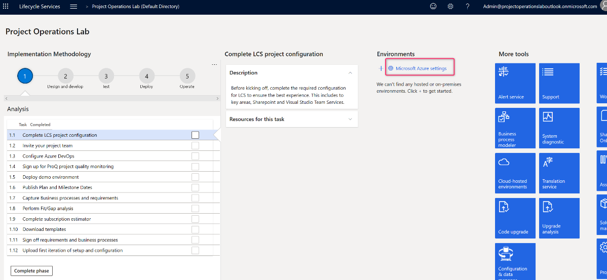
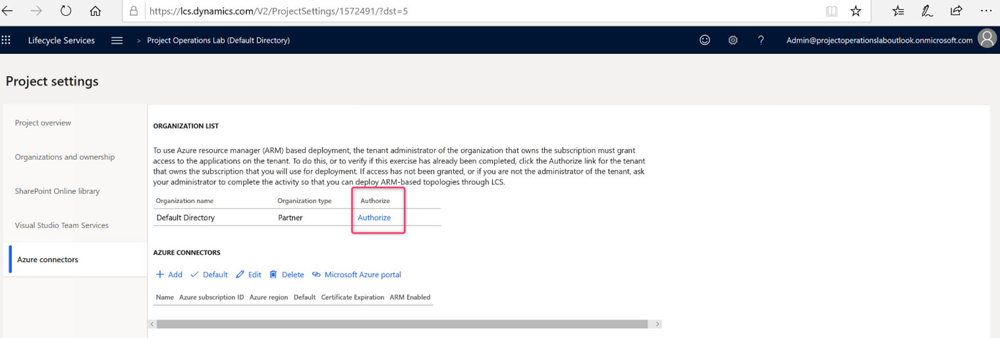
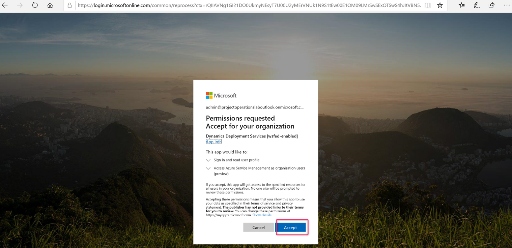
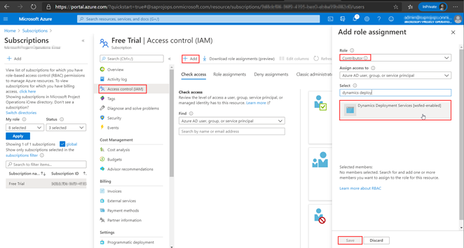

# Add an Azure subscription to an LCS project

_**Applies To:** Project Operations for resource/non-stocked based scenarios_

Cloud-hosted environments must be deployed using an existing Azure subscription. This topic explains how to connect your existing Azure subscription to an LCS project. 

## Grant admin consent

1. In your LCS project, in the **Environments** section, select **Microsoft Azure settings**.

2. On the **Project settings** page, on the **Azure connectors** tab, select **Authorize**. This allows environments to be deployed to this project.

3. Select **Authorize** again to provide admin consent.

4. Accept the permissions request.

The authorization is now complete. 

## Provide Dynamics Deployment Services access to your Azure subscription

1. Go to [Microsoft Azure billing](https://portal.azure.com/#blade/Microsoft\_Azure\_Billing/SubscriptionsBlade) and select your subscription. Dynamics Deployment Services needs to access this subscription to be able to deploy environments.

2. Select **Access control (IAM)** in the navigation pane, and then select **Add role assignment**.
3. In the slider on the right side, select **Contributor role**, and in the list provided, find and select **Dynamics Deployment Services**. 
4. Select **Save**.

### Add a subscription connector to an LCS project

1. In your LCS project, on the **Microsoft Azure settings** page, select **Add** to add a new connector.
2. Enter your Azure subscription ID. You can find your Azure subscription ID in the [Azure portal](https://ms.portal.azure.com/), under  **Settings**  in the lower left of the screen.
3. In the **Configure to use Azure Resource Manager** field, select **Yes**.
4. Make sure Azure's Subscription AAD Tenant Domain matches the domain-owning Azure subscription that you are using, and select **Next**.
5. On the **Microsoft Azure Setup** screen, select **Next** to confirm. If you receive an error on this screen, return to the section [Provide Dynamics Deployment Services access to Azure subscription](#provide) in this topic and make sure you have completed all of the steps.
6. Download the Azure Management Certificate to a local folder on your computer. Ask your Azure subscription administrator to upload the certificate to Azure Management Portal by selecting the subscription and going to **Settings** > **Management Certificates**. This certificate enables LCS to communicate with Azure on your behalf. You can skip this step if your user has access to the subscription.
7. Select  **Next**.
8. Select the Azure region to deploy in and select a data center that is close to where you plan to use this system.
9.  Select  **Connect**.

You have successfully connected your Azure subscription. You can now deploy Dynamics 365 Finance cloud-hosted environments.

[!INCLUDE[footer-include](../includes/footer-banner.md)]
