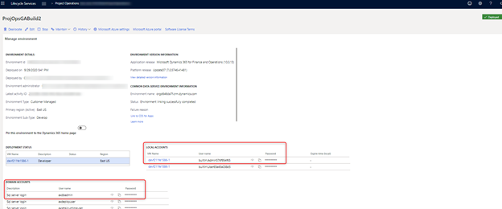
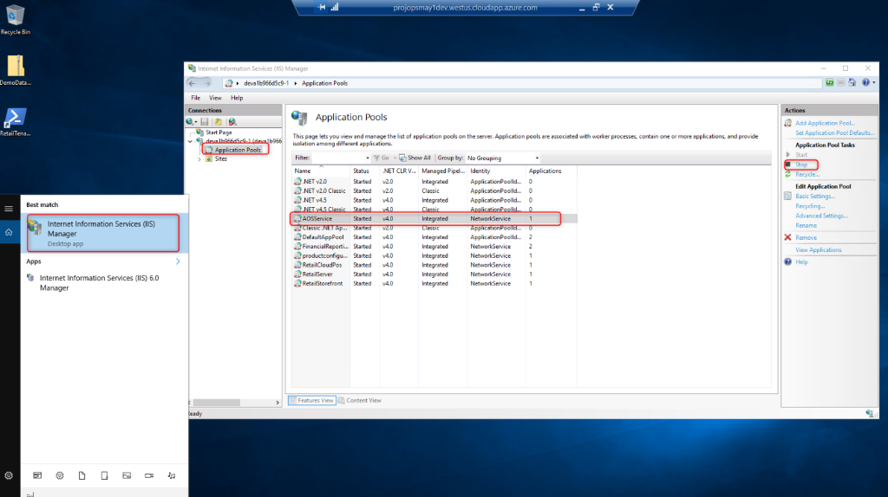
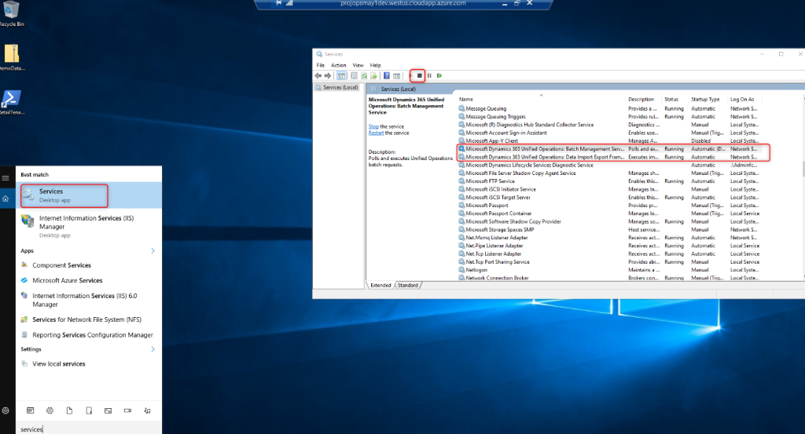
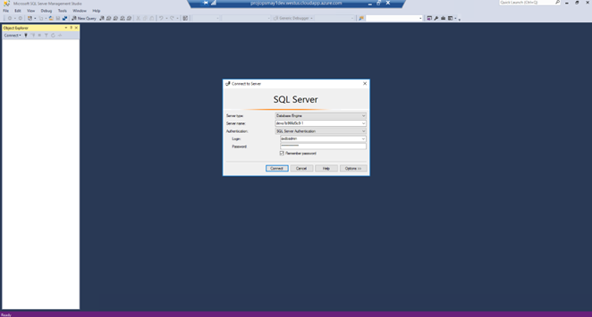
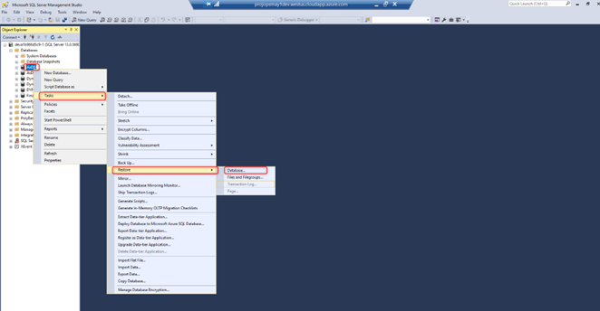
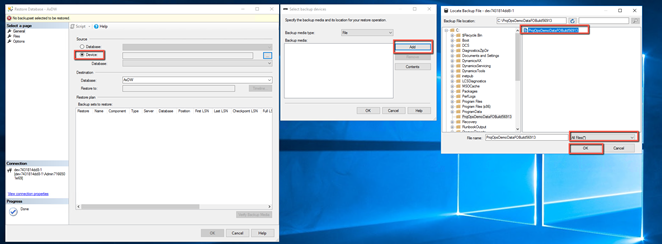
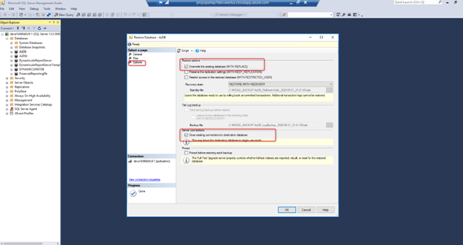
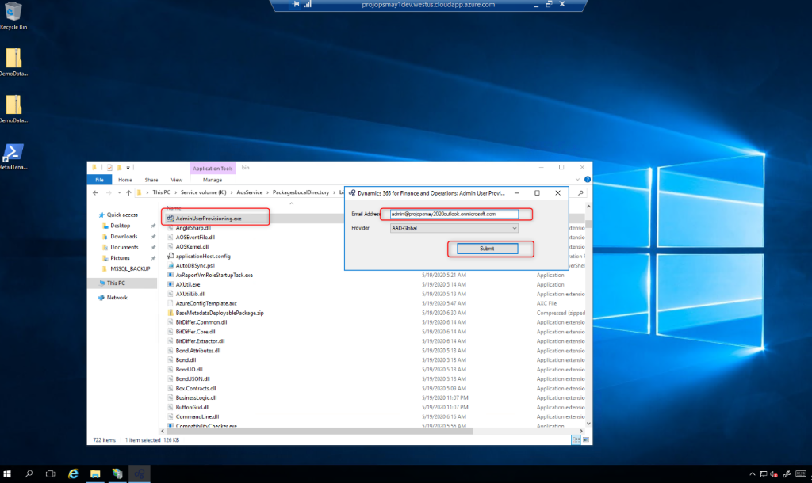
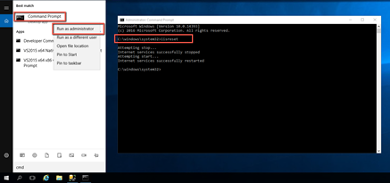
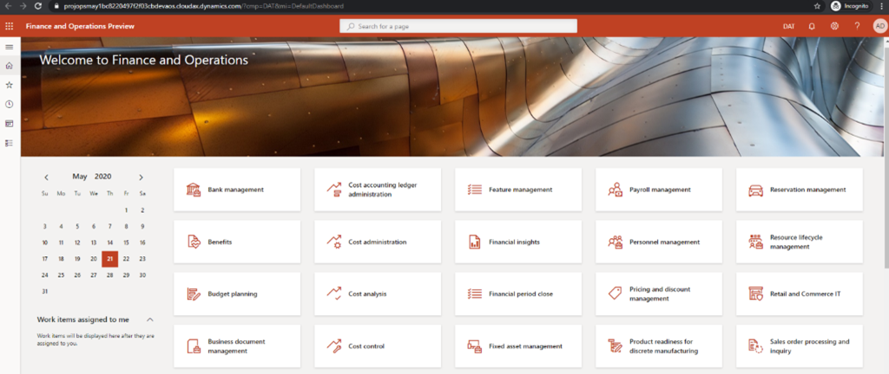

# Apply Project Operations demo data to a Finance Cloud-hosted environment

_**Applies To:** Project Operations for resource/non-stocked based scenarios_

> [!IMPORTANT]
> This topic is only applicable only Microsoft Dynamics 365 Finance version 10.0.13 and can be performed only on a Cloud-hosted environment. Complete the steps in this topic **BEFORE** you apply quality updates to the environment.

1. In your LCS project, open the **Environment details** page. Notice that it includes the details needed to connect to the environment by using Remote Desktop Protocol (RDP).

The first set of highlighted credentials are the local account credentials and contain a hyperlink to the remote desktop connection. The credentials include the environment admin username and password. The second set of credentials are used to log in to SQL Server in this environment.

2. Remote to the environment by the hyperlink in **Local Accounts**, and use the **Local Account credentials** to authenticate.
3. Go to **Internet Information Services** > **Application Pools** > **AOSService** and stop the service. You are stopping the service at this point so that you can continue to replace the SQL database.

4. Go to **Services** and stop the following two items:

- Microsoft Dynamics 365 Unified Operations: Batch Management Service
- Microsoft Dynamics 365 Unified Operations: Data Import Export Framework

5. Open Microsoft SQL Server Management Studio. Log in with SQL server credentials and use the axdbadmin user and password from the LCS **Environments details** page.

6. In Object Explorer, **Databases** and locate **AXDB**. You will replace database with a new database that is located in the [Download Center](https://download.microsoft.com/download/1/a/3/1a314bd2-b082-4a87-abdc-1ba26c92b63d/ProjOpsDemoDataFOGARelease.zip). 
7. Copy the zip file to the VM you are remoted into and extract zip contents.
8. In SQL Server Management Studio, right-click **AxDB**, and then select **Tasks** > **Restore** > **Database**.

9. Select **Source Device** and navigate to the file extracted from zip you copied.

10. Select **Options**, and then select **Overwrite the existing database** and **Close existing connections to destination database**. 
11. Select **OK**.

You will receive confirmation that the AXDB restore was successful. After you receive this confirmation, you can close SQL Services Management Studio.

12. Go back to **Internet Information Services** > **Application Pools** > **AOSService** and start the AOSService.
13. Go to **Services** and start the two services you stopped earlier.

14. Locate the AdminUserProvisioning tool on this VM. Look under, K:\AosService\PackagesLocalDirectory\bin\AdminUserProvisioning.exe.
15. Run the .ext file using your user address in the **Email Address** field. 
16. Select **Submit**.

This takes a couple of minutes to complete. You should receive a confirmation message that the Admin user was successfully updated.

17. Lastly, run Command Prompt as Administrator and perform iisreset

18. Close the remote desktop session and use the LCS **Environment details** page to log in to the environment to confirm it is working as expected.

