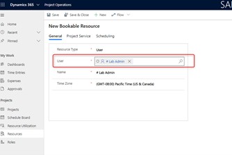
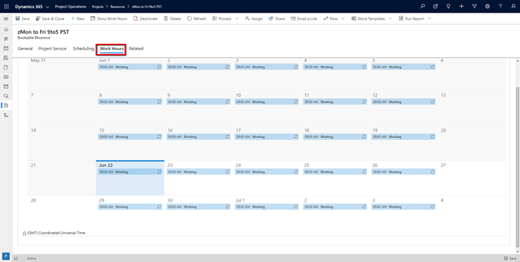
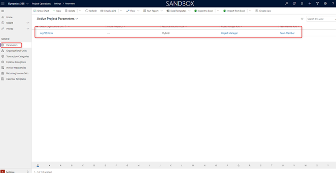
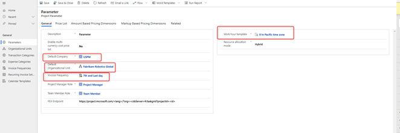

# Set up and apply configuration data in the Common Data Service for Project Operations

_**Applies To:** Project Operations for resource/non-stocked based scenarios_

## Install setup and configuration data

1. Download, unblock, and unzip the [Setup and Configuration Data Package](https://download.microsoft.com/download/1/3/4/1349369c-6209-42b7-b3b4-5be0e67cacd8/ProjOpsSampleSetupData-%20Integrated%20UR1.zip).
2. Navigate to the unzipped folder and run the executable file, *DataMigrationUtility*.
3. On page 1 of the Common Data Service Configuration Migration (CMT) Wizard, select **Import Data** and then select **Continue**.

4. On Page 2 of the CMT Wizard, select **Office 365** as the **Deployment Type**.
5. Select the **Display a list of available organizations** and **Show Advanced** check boxes.
6. Select the region of your tenant, enter your credentials, and select **Login**.

7. On page 3, from the list of organizations on the tenant, select the organization you want to import the demo data into and select **Login**.
8. On page 4, select the zip file, *SampleSetupAndConfigData* from the unpacked folder.

9. After the zip file is selected, select **Import Data**.

10. Import will run for approximately two-ten minutes depending on your network speed. After import completes, exit the CMT Wizard. 
11. Check your organization for data in the 19 entities listed below:

  - Currency
  - Organizational Unit
  - Contact
  - Tax Group
  - Customer Group
  - Unit
  - Unit Group
  - Price List
  - Project Parameter Price List
  - Invoice Frequency
  - Bookable Resource Category
  - Transaction Category
  - Expense Category
  - Role Price
  - Transaction Category Price
  - Characteristic
  - Bookable Resource
  - Bookable resource category Assn
  - Bookable Resource Characteristic

## Update Project Operations configurations

1. Navigate to the CE environment. You can find it by opening the [Power Platform Admin Center](https://admin.powerplatform.microsoft.com/environments), selecting the environment, and then selecting **Open Environment**. 

2. Go to **Projects** > **Resources** and then select **New** to create a bookable resource for your user.

3. On the **General** tab, select your admin user. Verify that the time zone matches the one you are in. 

4. On the **Scheduling** tab, in the **Company** field, pick the **USPM** company, and then select **Save**. 

5. Select the **Work hours** tab.  

6. Double-click on any value in the calendar and select **Edit** > **All events in the series**. 

7. Change work hours to an eight (8) hour work day, mark weekends as non-work days, and make sure time zone matches yours. 
8. Select **Save and close**.

9. Go to **Settings** > **Calendar templates** and select **New**.
 
 
 
 10. Enter a name, select the template resource you created, and then select **Save**. 
 
 
 
 11. Go to **Parameters** and double-click the record. 
 
 
 
12. Update the following fields:

 - **Default company**: USPM
 - **Default Organizational Unit**: Contoso Robotics Global
 - **Invoice Frequency**: 7th and Last day
 - **Work hour template**: Change to the template you created.

13. Select **Save**. 

