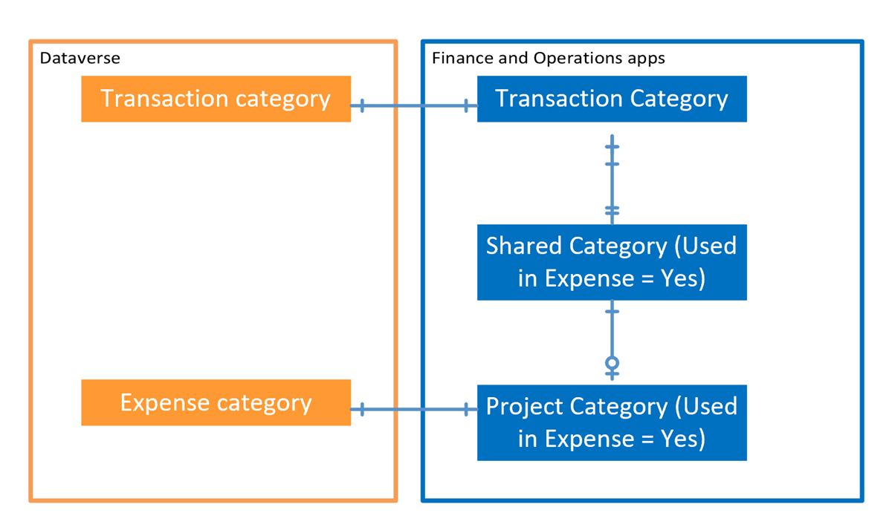
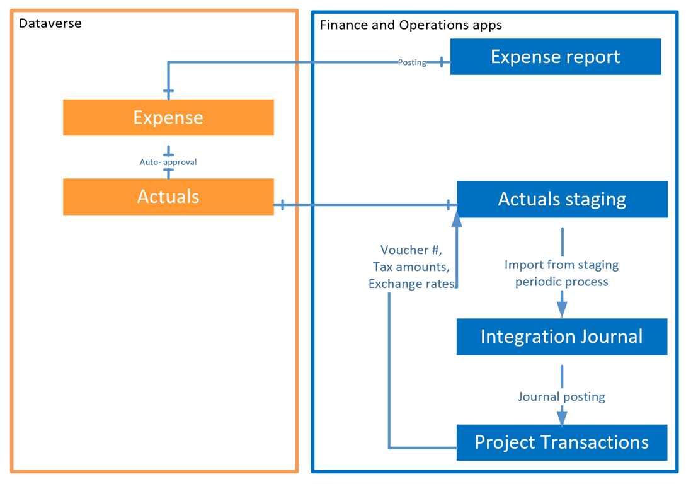

# Expense management integration

_**Applies To:** Project Operations for resource/non-stocked based scenarios_

This topic provides information about expense reports integration in Project Operations [full expense deployment](../expense/expense-overview.md) using dual-write.

## Expense categories

In a full expense deployment, expense categories are created and maintained in Finance and Operations apps. To create a new expense category, complete the following steps:

1. In Microsoft Dataverse, create a **Transaction** category. Dual-write integration will synchronize this transaction category to Finance and Operations apps. For more information, see [Configure project categories](/dynamics365/project-operations/project-accounting/configure-project-categories) and [Project Operations setup and configuration data integration](resource-dual-write-setup-integration.md). As a result of this integration, the system creates four shared category records in Finance and Operations apps.
2. In Finance, go to **Expense management** > **Setup** > **Shared categories** and select a shared category with an **Expense** transaction class. Set the **Can be used in Expense** parameter to **True** and define the expense type to use.
3. Using this shared category record, create a new expense category by going to **Expense management** > **Setup** > **Expense categories** and selecting **New**. When the record is saved, dual-write uses the table map, **Project Operations integration project expense categories export entity (msdyn\_expensecategories)** to synchronize this record to Dataverse.

  

Expense categories in Finance and Operations apps are company- or legal entity-specific. There are separate, corresponding legal entity-specific records in Dataverse. When a project manager estimates expenses, they can’t select expense categories that were created for a project that is owned by a different company than the company that owns the project they are working on. 

## Expense reports

Expense reports are created and approved in Finance and Operations apps. For more information, see [Create and process expense reports in Dynamics 365 Project Operations](/learn/modules/create-process-expense-reports/). After the expense report is approved by the Project manager, it's posted to the general ledger. In Project Operations, project-related expense report lines are posted using special posting rules:

  - Project-related cost (including non-recoverable tax) is not immediately posted to project cost account in general ledger, but instead is posted to expense integration account. This account is configured in **Project management and accounting** > **Setup** > **Project management and accounting parameters**, **Project Operations on Dynamics 365 Customer engagement** tab.
  - Dual-write synchronizes to Dataverse using **Project Operations integration project expenses export entity (msdyn\_expenses)** table map.
  - Tax subledger, vendor subledger, and other financial postings are recorded as applicable at the time of expense report posting.

  

When a record is written to the **Expense** entity in Dataverse, the system triggers the automated approval process of the record. If needed, the automated approval process status can be reviewed in Dataverse by going to **Advanced settings** > **System** > **System jobs**. After approval is complete, expense transaction class records are created in the **Actuals** entity.

Expense related actuals are then processed using the dual-write table map **Project Operations integration actuals (msdyn\_actuals)**. For more information, see [Project estimates and actuals](resource-dual-write-estimates-actuals.md).

The periodic process, **Import from staging** creates Expense report-related journal lines in the Project Operations Integration journal. The offset account defaults to the expense integration account. The Posting integration journal clears the account balance for the expense transaction and moves the expense amount to the project cost account. The system also creates project subledger transactions for downstream invoicing and revenue recognition purposes.
