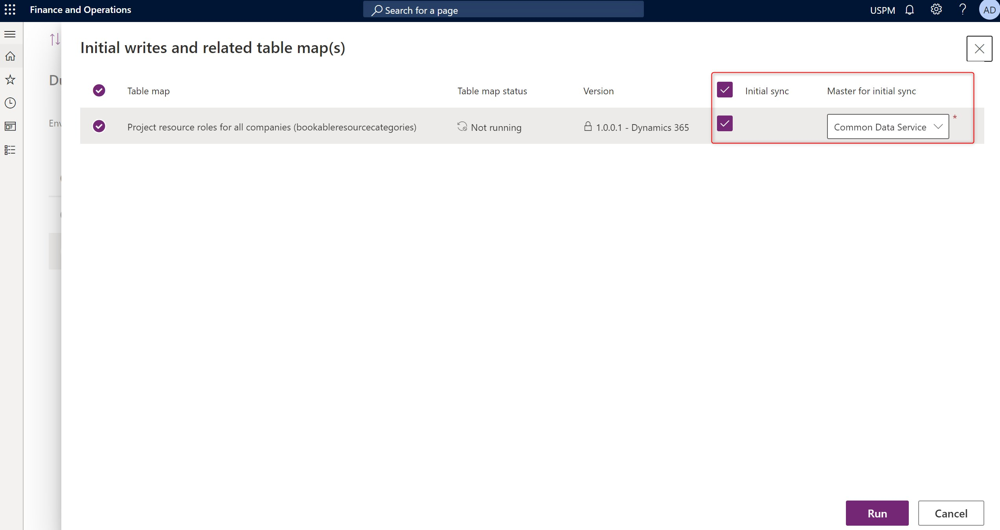

# Project Operations dual-write map versions

_**Applies To:** Project Operations for resource/non-stocked based scenarios_

Using Dynamics 365 Project Operations for resource/non-stocked scenarios requires a set of dual-write maps to be running in the environment. 

## Prerequisite maps: Dual-write orchestration solution

The following maps are required prerequisites for the Project Operations solution. Make sure to run the maps listed in the following table and any related table maps in your environment.

| Table map | Initial sync |
| --- | --- |
| Ledger (msdyn_ledgers) | Requires initial sync for the table map and all prerequisites. Master for initial sync is Finance and Operations apps. |
| Legal entities (cdm_companies) | Not required. The system populates this entity automatically when environments are linked using dual-write. |
| Customers V3 (accounts) | Not required for provisioning. |
| Vendors V2 (msdyn_vendors) | Not required for provisioning. |

1. From the list of maps, select the Ledger **(msdyn\_ledgers)** map with all prerequisites and select the **Initial sync** check box. In the **Master for initial sync** field, select **Finance and Operations apps** for both ledger map and all prerequisite maps. Select **Run**.

2. Follow the same steps for all remaining table maps listed in the above table. Do not select the **Initial sync** check box when running those maps.

## Project Operations dual-write maps

The following maps are required for a Project Operations solution. Dual write map versions are listed as of Project Operations May 2021 update, version 4.10.0.186.

| **Entity map** | **Latest version** | **Initial sync** |
| --- | --- | --- |
| Integration entity for project transaction relationships (msdyn\_transactionconnections) | 1.0.0.0 | Not required for provisioning. |
| Project contract headers (sales orders) | 1.0.0.1 | Not required for provisioning. |
| Project contract lines (salesorderdetails) | 1.0.0.0 | Not required for provisioning. |
| Project funding source (msdyn_projectcontractsplitbillingrules) | 1.0.0.2 | Not required for provisioning. |
| Project Operations integration table for material estimates (msdyn\_estimatelines) | 1.0.0.0 | Not required for provisioning. |
| Project invoice proposals V2 (invoices) | 1.0.0.3 | Not required for provisioning. |
| Project Operations integration actuals (msdyn_actuals) | 1.0.0.14 | Not required for provisioning. |
| Project Operations integration contract line milestones (msdyn_contractlinesscheduleofvalues) | 1.0.0.4 | Not required for provisioning. |
| Project Operations integration entity for expense estimates (msdyn_estimateslines) | 1.0.0.2 | Not required for provisioning. |
| Project Operations integration entity for hour estimates (msdyn_resourceassignments) | 1.0.0.5 | Not required for provisioning. |
| Project Operations integration project expense categories export entity (msdyn_expensecategories) | 1.0.0.1 | Not required for provisioning. |
| Project Operations integration project expenses export entity (msdyn_expenses) | 1.0.0.2 | Not required for provisioning. |
| Project Operations integration project vendor invoice export entity (msdyn_projectvendorinvoices) | 1.0.0.0 | Not required for provisioning. |
| Project Operations integration project vendor invoice line export entity (msdyn_projectvendorinvoicelines) | 1.0.0.1 | Not required for provisioning. |
| Project resource roles for all companies (bookableresourcecategories) | 1.0.0.1 | Requires an initial sync for the table map to synchronize the Project Manager and Team member resource roles that are populated in the Dynamics 365 Dataverse environment during provisioning. Dataverse is the main source for the initial synchronization. |
| Project tasks (msdyn_projecttasks) | 1.0.0.4 | Not required for provisioning. |
| Project transaction categories (msdyn_transactioncategories) | 1.0.0.0 | Not required for provisioning. |
| Projects V2 (msdyn_projects) | 1.0.0.2 | Not required for provisioning. |

Complete the following steps to run the listed maps.

1. Enable the Project resource roles for **all companies (bookableresourcecategories)** table map as this map requires the initial sync. In the **Master for initial sync** field, select **Common data service**. 

 

 Wait until the status of the map is **Running** before you move to the next step.

2. Select all of the remaining required maps. You can filter them in the dual-write map list using the keyword, **Project** in search in the upper-right corner. You can multi-select all maps and then run. For more information, see [Manage multiple table maps](/dynamics365/fin-ops-core/dev-itpro/data-entities/dual-write/multiple-entity-maps). Make sure to also enable and run related entity maps.

### Project Operations dual-write map versions

Always run the latest version of the map in your environment. Certain features and capabilities might not work correctly if any of the following conditions exist:

- A map isn't activated.
- The latest version of the map isn't activated. 
- Related table maps aren't activated.

You can view the active version of the map in the **Version** column on the **Dual-write** page. You can activate a new version of the map by selecting **Table map versions**, selecting the latest version, and then saving the selected version. If you have customized an out-of-the-box table map, you will need reapply the changes. For more information, see [Application lifecycle management](/dynamics365/fin-ops-core/dev-itpro/data-entities/dual-write/app-lifecycle-management).
