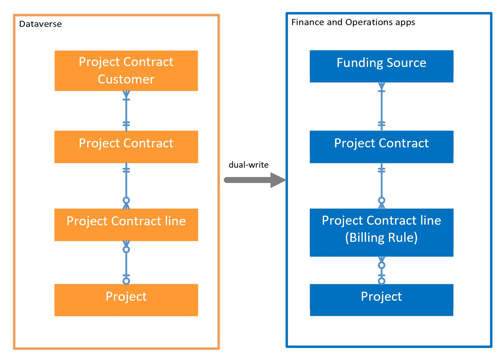
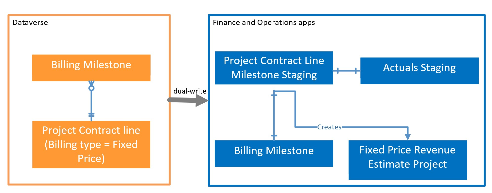
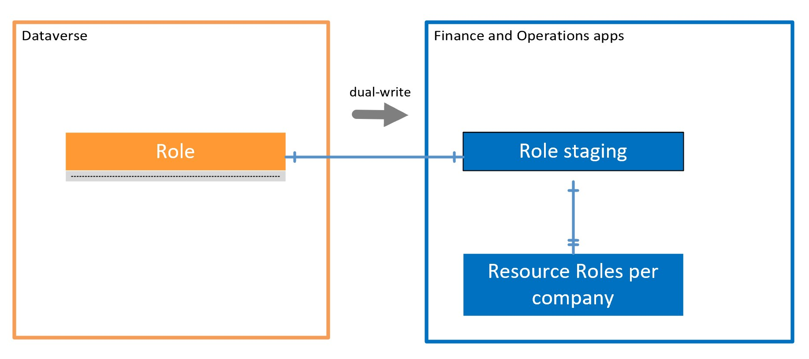
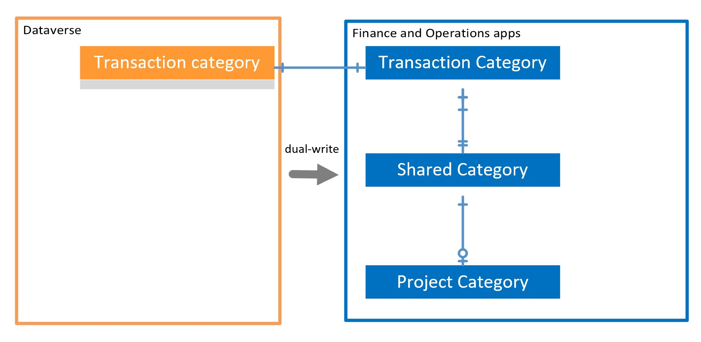

# Project Operations setup and configuration data integration

_**Applies To:** Project Operations for resource/non-stocked based scenarios_

This topic provides information about Project Operations dual-write integration for setup and configuration entities.

## Project contracts, contract lines, and projects

Project contracts, contract lines, and projects are created in Dataverse and synchronized to Finance and Operations apps for additional accounting. The records in these entities can be created and deleted only in Dataverse. However, accounting attributes such as sales tax group defaults and financial dimensions can be added to these records in the Finance and Operations apps.

  

Sales activity leads, opportunities, and quotes are tracked in Dataverse and don't synchronize to Finance and Operations apps because there is no downstream accounting associated with this activity.

The project contract functionality in Dataverse creates a project contract record in Finance and Operations apps using the **Project contract headers (salesorders)** table map. Saving a project contract in Dataverse also starts the creation of a project contract customer entity record. This record is synchronized to Finance and Operations apps using the **Project funding source (msdyn\_projectcontractssplitbillingrules)** table map. This map also synchronizes project contract customer additions, updates, and deletions. Split billing percentages between project contract customers are mastered only in Dataverse and not synchronized to Finance and Operations apps.

After a project contract is created in Dataverse, the project accountant can update the accounting attributes for this project contract in Finance and Operations apps by going to **Project management and accounting** > **Project contracts** > **Set up** > **Show default accounting**. The accountant can review operational project contract attributes, such as requested delivery date and contract amount by selecting the project contract ID in Finance and Operations apps which opens the related project contract record in Dataverse.

The project entity is synchronized to Finance and Operations apps using the **Projects V2 (msdyn\_projects)** table map. The project accountant can:

  - Review projects in Finance and Operations apps by going to **Project management and accounting** > **All projects**. 
  - Update accounting attributes for the project in Finance and Operations apps by going to **Project management and accounting** > **All projects** > **Set up** > **Show default accounting**.  
  - Review operational project attributes, such as estimated start and end dates, by selecting the project ID in Finance and Operations apps which opens the related project record in Dataverse.

A project is associated with a project contract through the **Project contract line** entity.

Project contract lines in Dataverse creates a project contract billing rule in Finance and Operations apps using the **Project contract lines (salesorderdetails)** table map. The billing method defines the project contract billing rule type in Finance and Operations apps:

  - Project contract lines with a billing method of time and material create a billing rule of time and material type.
  - Fixed price billing method contract lines create a milestone billing rule.

Project contract lines can be reviewed by the project accountant in Finance and Operations apps by going to **Project management and accounting** > **Project contracts** > **Set up** > **Show default accounting**, and reviewing the details on the **Contract lines** tab. The accountant can also set default financial dimensions for the fixed price billing method contract lines on this tab.

## Billing milestones

Project contract lines using the fixed price billing method are invoiced through billing milestones. Billing milestones are synchronized to project on-account transactions in Finance and Operations apps by using the **Project Operations integration contract line milestones (msdyn\_contractlinescheduleofvalues)** table map.

  

The accountant can review on-account transactions and adjust the accounting attributes for those transactions by going to **Project management and accounting** > **Project contracts** > **Maintain** > **On-account transactions** or **Project management and accounting** > **All projects** > **Maintain** > **On-account transactions**.

When you first create a billing milestone for a given project contract line, the system automatically creates a fixed price revenue estimate project for the project associated with this contract line. Fixed-price revenue estimate projects can be reviewed by going to **Project management and accounting** > **Fixed-price revenue estimate projects**.

### Project tasks

Project tasks are synchronized to Finance and Operations apps through the **Project tasks (msdyn\_projecttasks)** table map for reference purposes only. Creating, updating, and deleting operations isn't supported through Finance and Operations apps.

  

## Project resources

The **Project resource roles** entity is synchronized to Finance and Operations apps using the **Project resource roles for all companies (bookableresourcecategories)** table map for reference purposes only. Because resource roles in Dataverse are not company-specific, the system automatically creates respective company-specific resource roles records in Finance and Operations apps automatically for all legal entities included into dual-write integration scope.

Project resources in Project Operations are maintained in Dataverse and aren't synchronized to Finance and Operations apps.

### Transaction categories

Transaction categories are maintained in Dataverse and synchronized to Finance and Operations apps using the **Project transaction categories (msdyn\_transactioncategories)** table map. After the transaction category record is synchronized, the system automatically creates four shared category records. Each record corresponds to a transaction type in Finance and Operations apps and links them to the transaction category record.

Using transaction categories for estimates and actuals requires the project accountant or system administrator to create corresponding project categories in every legal entity. For more information, see [Configure project categories](../project-accounting/configure-project-categories.md).
