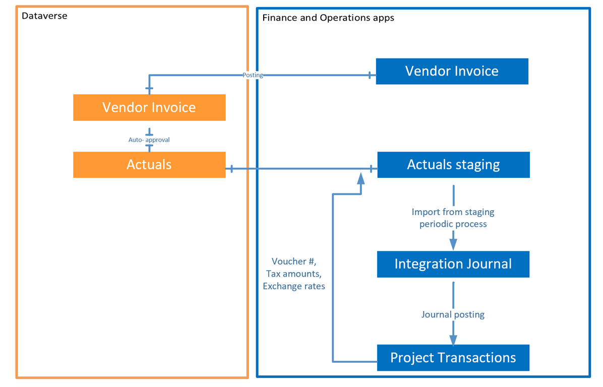

# Vendor invoice integration

_**Applies To:** Project Operations for resource/non-stocked based scenarios_

Project-related procurement in Dynamics 365 Project Operations can be recorded by going to **Accounts Payable** > **Invoices** > **Pending vendor invoices** and using a pending vendor invoice document. For more information, see [Purchase non-stocked materials using a pending vendor invoice](../procurement/pending-vendor-invoices.md).

> [!IMPORTANT]
> Before you use the functionality described in this topic, review and apply the required configurations. For more information, see [Enable non-stocked materials and pending vendor invoices](../procurement/configure-materials-nonstocked.md).

In Project Operations, project-related vendor invoices are posted using special posting rules:

- Project-related cost (including non-recoverable tax) isn't immediately posted to the project cost account in the general ledger. Instead, the cost is posted to the **Procurement integration account**. This account is configured in **Project management and accounting** > **Setup** > **Project management and accounting parameters** on the **Project Operations on Dynamics 365 Customer engagement** tab.
- Dual-write synchronizes vendor invoice details to Microsoft Dataverse using the following table maps:

     - **Project Operations integration project vendor invoice export entity (msdyn_projectvendorinvoices)**: This table map synchronizes vendor invoice header information. Only vendor invoices with at least one line that contains a project ID are synchronized to Dataverse.
     - **Project Operations integration project vendor invoice line export entity (msdyn_projectvendorinvoicelines)**: This table map synchronizes vendor invoice line information. Only lines that contain a project ID are synchronized to Dataverse.

     > [!NOTE]
     > Vendor invoice details in Dataverse are not editable.

Tax subledger, vendor subledger, and other financial postings are recorded as applicable in Dynamics 365 Finance when the vendor invoice is posted.

When records are written to a **Vendor invoice** entity in Dataverse, an automated approval process of the records begins. If needed, the automated approval process status can be reviewed in Dataverse by going to **Advanced settings** > **System** > **System jobs**. After the approval is complete, the system creates material transaction class records in the **Actuals** entity.

Material-related actuals are then processed using the dual-write table map, **Project Operations integration actuals (msdyn_actuals)**. For more information, see [Project estimates and actuals](resource-dual-write-estimates-actuals.md).

The periodic process, **Import from staging** creates vendor invoice-related Project Operations integration journal lines. The offset account defaults to the procurement integration account. When the integration journal is posted, the account balance is cleared for the vendor invoice transaction and the line amount is moved to the project cost account. Project subledger transactions are also created for downstream invoicing and revenue recognition purposes.
