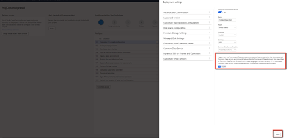
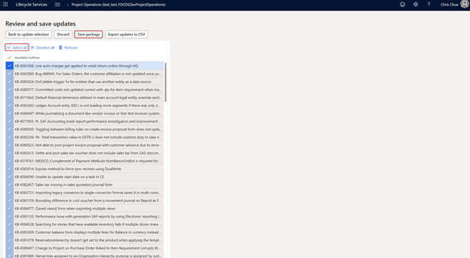
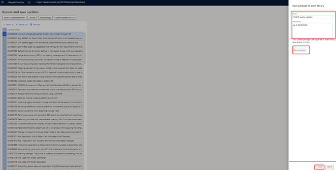
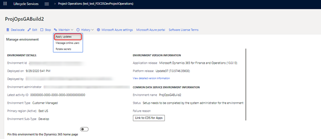
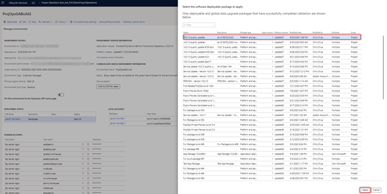
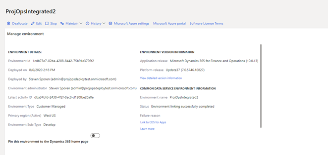
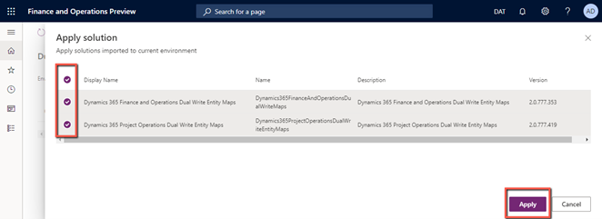
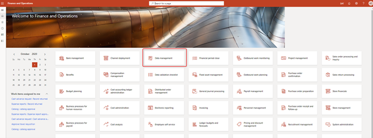
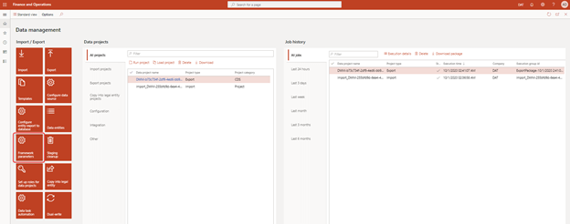
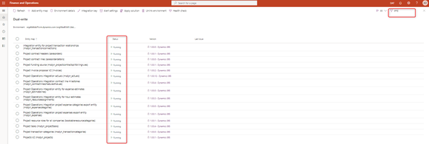

# Provision a new environment

_**Applies To:** Project Operations for resource/non-stocked based scenarios_

This topic provides information about how to provision a new Dynamics 365 Project Operations environment for resource/non-stocked based scenarios.

## Enable Project Operations automated provisioning in an LCS project

Use following steps to enable the Project Operations automated provisioning flow for your LCS project.

1. Go to [LCS](https://lcs.dynamics.com/v2) and select the **Preview Feature management** tile.
2. In the **Preview feature** list, select **Project Operations** and the select **Preview feature enabled** to enable Project Operations.

> [!NOTE]
> This step is performed only one time per LCS project.

## Provision a Project Operations environment

1. Open a new Dynamics 365 Finance [demo environment](https://docs.microsoft.com/dynamics365/fin-ops-core/dev-itpro/deployment/deploy-demo-environment) or [sandbox/ production environment](https://docs.microsoft.com/edynamics365/fin-ops-core/dev-itpro/deployment/deployenvironment-newinfrastructure) deployment. 
2. Walk through the **Environment provisioning** wizard. 

> [!IMPORTANT]
> Make sure selected application version is 10.0.13 or higher.

3. To provision Project Operations, under **Advance settings**, select **Common Data Service**. 
4. Enable the **Common Data Service Setting** by selecting **Yes** and then enter information in the required fields:

  - Name
  - Region
  - Language
  - Currency

5. In the **Common Data Service Template** field, select **Project Operations**.

> [!IMPORTANT]
> Select **Agree** to acknowledge the terms of service and then select **Done** to return to the deployment settings.

6. Complete the remaining required fields in the wizard and confirm the deployment. Environment provisioning time varies based on the environment type. Provisioning might take up to six hours.

  After the deployment completes successfully, the environment will show as **Deployed**.

7. To confirm the environment has deployed successfully, select **Login** and log on to the environment to confirm.

## Apply Project Operations Finance demo data (optional step)

Apply Project Operations Finance demo data to 10.0.13 service release Cloud Hosted Environment as described in [this article](resource-apply-finance-demo-data.md).

## Apply updates to the Finance environment

Project Operations requires a Finance environment with application version **10.0.13 (10.0.569.20009)** or higher.

You might need to apply quality updates to your Finance environment to receive this version.

1. In LCS, on the **Environment details** page, in the **Available Updates** section, select **View Update**.

2. On the **Binary updates** page, select **Save package.**

3. Click **Select all** and then select **Save package**.

4. Enter a name and a description of the package, and then select **Save**. Depending on the internet connection, this process might take some time.

5. After the package is saved, select **Done** and save this package to the Assets library in your LCS project.

Saving and validating the package might take ~15 minutes.

6. To apply the update, navigate to the **Environment details** page in LCS and select **Maintain** > **Apply updates**.

7. In the updates list select the package you created, and select **Apply**.

Environment servicing will take some time. After it is complete, the environment will return to a deployed state.

## Establish a Dual Write connection 

1. In your LCS project, go to the **Environment details** page.
2. Under **Common Data Service Environment Information**, select **Link to CDS for Apps**.
3. After the link is complete, select **Link to CDS for Apps** again. You will be redirected to Dual Write in Finance.

4. Select **Apply Solution** to access the entities that will be mapped in the integration.

5. Select both solutions, **Dynamics 365 Finance and Operations Dual Write Entity Map** and **Dynamics 365 Project Operations Dual Write Entity Maps**, and then select **Apply**.

After the solutions are applied, the Dual Write entities are applied to the environment.

After the entities are applied, all available mappings are listed in the environment.

## Refresh the data entities after the update

1. In Finance, go to the **Data management** workspace.

2. Select the **Framework parameters** tile.

3. On the **Entity settings** page, select **Refresh Entity list**.

The refresh is going to take approximately 20 minutes. You will receive an alert when it is complete.

## Run Project Operations Dual Write maps

1. In your LCS project, go to the **Environment details** page.
2. Under **Common Data Service Environment Information**, select **Link to CDS for Apps.** After you select the link, you will be redirected to the list of entities in the mappings.
3. Start the maps as described in the following table. Make sure to follow the sequence as listed.

| **Entity Map** | **Refresh entity** | **Initial sync** | **Master for initial sync** | **Run prerequisites** | **Prerequisites initial sync** |
| --- | --- | --- | --- | --- | --- |
| **Project Resource Roles for All Companies (bookableresourcecategories)** | No | Yes | Common Data Service | No | N\A |
| **Legal entities (cdm\_companies)** | No | Yes | Finance and Operations apps | No | N\A |
| **Project Operations integration actuals (msdyn\_actuals)** | No | No | N\A | Yes | No |
| **Project contract lines (salesorderdetails)** | No | No | N\A | No | No |
| **Integration entity for project transaction relationships (msdyn\_transactionconnections)** | No | No | N\A | No | N\A |
| **Project Operations integration contract line milestones (msdyn\_contractlinesscheduleofvalues)** | No | No | N\A | No | N\A |
| **Project Operations integration entity for expense estimates (msdyn\_estimateslines)** | No | No | N\A | No | N\A |
| **Project Operations integration entity for hour estimates (msdyn\_resourceassignments)** | No | No | N\A | No | N\A |
| **Project Operations integration project expenses export entity (msdyn\_expenses)** | Yes | No | N\A | No | N\A |
| **Project Operations integration entity for hour estimates (msdyn\_resourceassignments)** | Yes | No | N\A | No | N\A |

4. To refresh the entity, select the map name, and then select **Refresh entities**. 
5. Proceed with running the map after the refresh is complete.

Before you enable the next map, verify that the map in the table is in a state of **Running**. Running maps with a larger number of prerequisites might take some time.

To run a map with prerequisites, enable the **Show related entity maps** toggle. If the table indicates **Prerequisite initial sync** is **No**, verify that the **Initial sync** flag is **Off** in all the prerequisite maps before you run it.

6. Validate all project related maps are in the running state.

Your Project Operations environment is now provisioned and configured.
