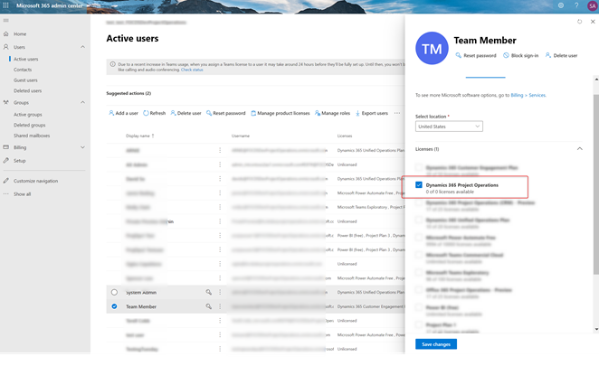

# Sign up for Project Operations preview subscriptions for resource/ non-stocked scenarios

_**Applies To:** Project Operations for resource/non-stocked based scenarios_

This topic explains how to subscribe to the preview/partner offer and deploy Project Operations environment for resource/ non-stocked based scenarios.

## Prerequisites

- You will receive an email inviting you to participate in the preview. You can request a preview on the [Project Operations website](https://dynamics.microsoft.com/en-us/project-operations/overview/).
- The user who deploys the preview must have Azure tenant global administrator rights.
- Deploying a Finance environment requires a valid Azure subscription that will be billed per environment. You can use your organizations existing subscription or use an [Azure trial](https://azure.microsoft.com/en-us/free/) to get started. The CDS environment will be provided free for a limited 30 day period.

## Subscribe

When your [preview request](https://forms.office.com/FormsPro/Pages/ResponsePage.aspx?id=v4j5cvGGr0GRqy180BHbR56j8lZs0FdAvwT75_WNFyxUMkRDV1NYQU5TNjE2VjhKOVBUNVg2R0s1NC4u) is approved, you will receive three offers from Microsoft by email. These offers allow you to deploy the Project Operations Preview:

- Office 365 Project Operations - Preview Trial
- Dynamics 365 Project Operations (CRM) - Preview Trial
- Dynamics 365 Finance preview trial

> [!IMPORTANT]
> Only one person, the tenant administrator, in an organization needs to perform this task. If you aren't the subscriber to this release, wait until your organization has been signed up and you've received your user credentials.

### Dynamics 365 Project Operations – Preview trial

1. Redeem the first offer, **Office 365 Project Operations - Preview Trial**, with the URL provided in your welcome email.

2. Verify that you are logged in as the user who belongs to the organization who will be subscribing to the service.
3. Proceed with redeeming the offer. 
4. Select **Yes, add it to my account**.

### Dynamics 365 Finance preview trial

Repeat the same steps with the second offer from the Welcome email.

## Assign Licenses

> [!IMPORTANT]
> You will need administrative access to your organization's Office 365 Portal to complete the following steps.

1. Go to [Microsoft 365 admin center](https://portal.office.com/) to assign licenses to your users.

2. On the **Active users** page, select the users that you want to assign a license to.

3. Verify that the Project Operations license has been selected and select **Save changes**. 

> [!NOTE]
> The Finance trial offer does not need to be assigned to a user.

## Start a new project in LCS

Create a new LCS project as described in the topic, [Start a new project in LCS](create-lcs-project.md)

## Add an Azure subscription to an LCS project

To complete this task, follow the steps in the topic, [Add an Azure subscription to LCS project](resource-add-azure-subscription-lcs-project.md).

## Deploy Finance demo environment with Project Operations for resource/non-stocked scenarios

Follow the guidance in the topic, [Provision a new environment](resource-provision-new-environment.md) to complete the deployment. Use the [demo environment](https://docs.microsoft.com/dynamics365/fin-ops-core/dev-itpro/deployment/deploy-demo-environment) deployment type for preview.

## Install CDS setup and configuration data

Install CDS setup and configuration data as described in the topic, [Set up and apply configuration data in the Common Data Service](resource-apply-pro-setup-config-data.md).

