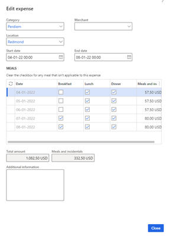
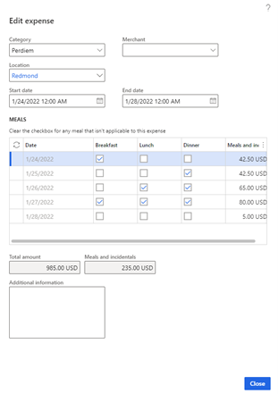

---
# required metadata

title: Per diem expenses
description: This topic provides information about how to work with per diem expenses.
author: suvaidya
ms.date: 01/26/2022
ms.topic: article
ms.prod: 
#

# optional metadata

ms.search.form: 
audience: Application User
# ms.devlan: 
ms.reviewer: kfend
ms.search.scope: 
# ms.tgt_pltfrm: 
# ms.custom: 
ms.search.region: 
# ms.search.industry: 
ms.author: suvaidya
ms.search.validFrom: 
ms.dyn365.ops.version: 
---

> [!IMPORTANT] 
> Functionality that is described in this topic is available to targeted users as part of a preview release.

# Per diem expenses

A per diem payment is a fixed, predetermined daily allowance that a company pays to its employees for lodging (hotels), meals, and incidental expenses that those employees incur while they travel for work. The company pays this allowance to the employees instead of paying the actual travel expenses. Employees can use their **Incidentals/Other** per diem allowance to cover tips, room service, laundry, or dry-cleaning services for important business meetings. The per diem rate can vary, depending upon whether the employer chooses to reimburse for the combined cost of lodging and meals, or only for the cost of meals and incidentals.

Per diem rates can be based on the time of year, the travel location, or both. When you create a per diem rule, you can specify that a percentage of the per diem rate will be withheld if an employee receives complimentary meals or services. You can also set a minimum number of hours and a maximum number of hours that the per diem rate can be applied to an employee's travel.

The per diem is calculated as the total allowance that is offered per day minus the meal reduction (cost of complimentary meals) that is provided to the employee.

## Per diems in the reimagined expense interface

The per diem feature is supported in the reimagined **Expense Management** workspace in Microsoft Dynamics 365 Finance version 10.0.25 and later.

To enable per diems, follow these steps.

1. In the **Feature Management** workspace, find and select the **Expense Reports Reimagined** feature in the list, and then select **Enable now**.
2. Find and select the **Per-diem for expense report re-imagined interface** feature in the list, and then select **Enable now**.

## Configure per diems

To configure per diem expenses, follow these steps.

1. Go to **Expense management** \> **Setup** \> **General** \> **Expense management parameters**.
2. On the **Per diem** tab, in the **Calculate meal reduction by** field, select how per diems should be calculated:

    - **Meal type per trip** – Calculate the per diem based on the type of meal that is entered (breakfast, lunch, or dinner) and on the meal reduction that is specified for each meal type for the per diem allowance for the duration of the trip.
    - **Meal type per day** – Calculate the per diem based on the type of meal that is entered and on the meal reduction that is specified for each meal type for the per diem allowance per day.
    - **Number of meals per day** – Calculate the per diem based on the number of meals that are entered per day and on the meal reduction for the number of meals that are provided each day.

3. Go to **Expense management** \> **Setup** \> **Calculations and codes** \> **Per diem locations**.
4. Add locations where per diems can be used.
5. For each location that you add, on the **Per diems** tab, select the per diem rate and currency that are valid between specific start and end dates for lodging, meals, and other expenses. To configure per diem rates and currencies, go to **Expense management** \> **Setup** \> **Calculations and codes** \> **Per diems**.

## How the feature works

This section provides examples for three configuration scenarios. For each example, the **Calculate meal reduction by** field is set to a different value. For all three examples, the total amount that is payable is the same until the meal reduction is applied. After that point, the total amount payable differs for each example.

To create the per diem expense that is used for all three examples, follow these steps.

1. Go to **Workspaces** \> **Expense Management**.
2. Select **New expense report**, or select an existing expense report.
3. Add a new expense. In the **Category** field, select **Per diem**. Select the location, and the start and end dates of your trip. The per diem for lodging, meals, and incidentals (other expenses) is calculated based on the daily allowance that is set for the selected location.

    For example, you select **Redmond (USA)** as the location. The daily allowance for that location is 150 US dollars (USD 150) for lodging, USD 75 for meals, and USD 5 for incidentals. The start date is January 10, and the end date is January 14. Therefore, the selected duration is five days (assuming calendar days with time). Here are the calculations:

    - Total amount payable = 5 × (150 + 75 + 5) = 5 × 230 = USD 1,150
    - Meal and incidental portion of the total amount = 5 × (75 + 5) = USD 400

If breakfast, lunch, and dinner were provided during the trip, those meals must be accounted for as a meal reduction.

### Example 1: Per diem where meal reductions are based on meal type per trip

In this example, the meal reduction is 30 percent for breakfast, 30 percent for lunch, and 40 percent for dinner. On the **Expense management parameters** page, the **Calculate meal reduction by** field is set to **Meal type per trip**. Here are the calculations if three breakfasts, two lunches, and zero dinners were provided to the employee:

- Meal reduction = (3 × \[75 × 30%\]) + (2 × \[75 × 30%\]) + 0 = (3 × 22.50) + (2 × 22.50) + 0 = 67.50 + 45 + 0 = USD 112.50
- Meals and incidentals = 400 – 112.50 = USD 287.50
- Total amount payable = Total allowance – Meal reduction = 1,150 – 112.50 = USD 1,037.50

###	Example 2: Per diem where meal reductions are based on meal type per day

In this example, the meal reduction is 30 percent for breakfast, 30 percent for lunch, and 40 percent for dinner. On the **Expense management parameters** page, the **Calculate meal reduction by** field is set to **Meal type per day**. In this case, in the **Meals** grid in the **Edit expense** dialog box, you clear checkboxes to indicate which meals were provided to you during your trip.

For example, here are the calculations if breakfast was provided for the first three days of the trip:

- Daily meal reduction for each of the first three days = 75 × 30% = USD 22.50
- Total meal reduction = 3 × 22.50 = USD 67.50
- Meals and incidentals for days 1 through 3 = 75 – 22.50 = USD 57.50
- Total meals and incidentals = Sum of meals and incidentals across five days = 400 – 67.50 = USD 332.50
- Total amount payable = Total amount – Meal reduction = 1,150 – 67.50 = USD 1,082.50

### Example 3: Per diem where meal reductions are based on number of meals per day

In this example, the meal reduction is calculated based on the number of meals that were provided per day (that is, the **Calculate meal reduction by** field on the **Expense management parameters** page is set to **Number of meals per day**). In the **Meals** grid in the **Edit expense** dialog box, you clear checkboxes to indicate which meals were provided.

Here are the calculations for per diems when the daily allowance is USD 150 for lodging, USD 75 for meals, and USD 5 for incidentals:

- **One meal:** Meal reduction = 20% = USD 15
- **Two meals:** Meal reduction = 50% = USD 37.50
- **Three meals:** Meal reduction = 100% = USD 75

Here are the calculations for the meals and incidentals allowance, which includes USD 5 for incidentals:

- One meal = (75 – 15) + 5 = 60 + 5 = USD 65
- Two meals = (75 – 37.50) + 5 = 37.50 + 5 = USD 42.50
- Three meals = (75 – 75) + 5 = 0 + 5 = USD 5
- Total meals and incidentals = Sum of meals and incidentals per day = USD 235
- Total amount payable = Total allowance – Total meal reduction = USD 985

> [!NOTE]
> As of Finance version 10.0.23, if you use the reimagined expense interface, you can't create per diem expenses that have overlapping dates. If you try, you will receive an error message.
