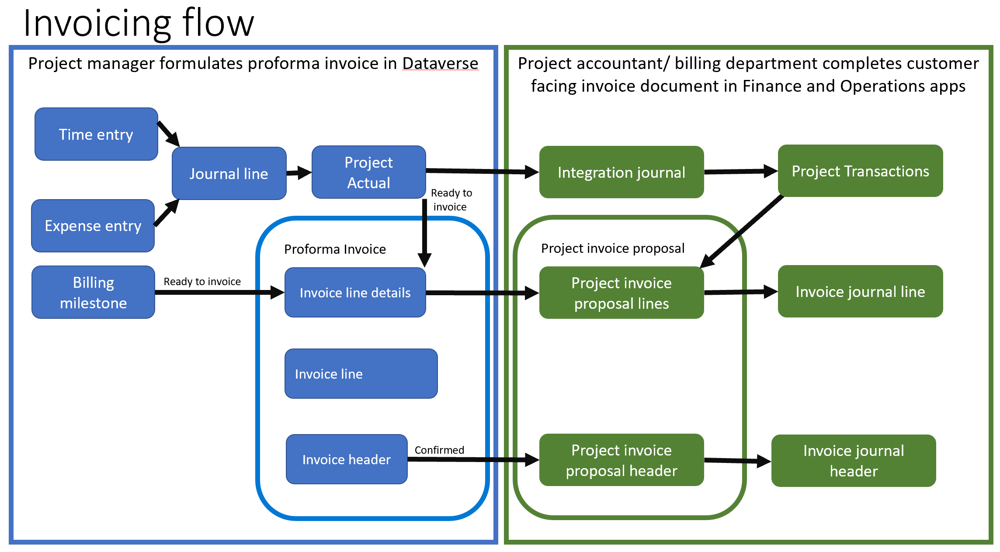

# Invoicing process overview

_**Applies To:** Project Operations for resource/non-stocked based scenarios_

Project Operations for resource/non-stocked based scenarios offers comprehensive capabilities tailored to fit the needs of both Project manager and Accounts receivable clerk/project accountant. For the invoicing process, the Project manager manages the project billing backlog and the Accounts receivable clerk/project accountant creates a compliant and accurate customer-facing invoice document.

The project contract line defines the billing method for associated project transactions. When the Project manager approves time and expense transactions, the system records the transactions in the **Project Actuals** entity and sends the information to the **Project management and accounting** module in Dynamics 365 Finance. The Project accountant then reviews and posts the records using the [Project Operations Integration journal](../project-accounting/project-operations-integration-journal.md). This journal includes important accounting details for project actuals, such as billing, sales tax group, billing item sales tax group, and financial dimensions.

The Project manager can review unbilled sales transactions using the time and material billing method in the [Time and material billing backlog](../proforma-invoicing/manage-billing-backlog.md#time-and-material-billing-backlog) and fixed price billing in [Fixed price milestones](../proforma-invoicing/manage-billing-backlog.md#fixed-price-milestones). These views allow you to filter and select transactions that need to be included in the next billing cycle and then mark them as **Ready to Invoice**.

You can [manually create a proforma invoice](../proforma-invoicing/create-manual-proforma-invoice.md) or use a [periodic process](../proforma-invoicing/configure-automated-invoice-creation.md). The Project manager can [adjust a draft proforma invoice](../proforma-invoicing/manage-proforma-invoice.md) as needed and then confirm it.

The confirmed proforma invoice is sent to the **Project management and accounting** module in Finance. The Project accountant formats and updates the project invoice proposal, and then posts and prints the document. Posted project invoices are recorded in the General ledger, as well as the Customer and Project subledgers.

[!INCLUDE[footer-include](../includes/footer-banner.md)]