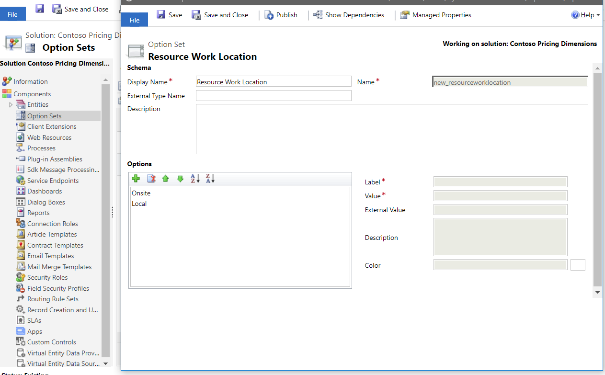

---
# required metadata

title: Create custom fields and entities as pricing dimensions
description: This topic provides information about how to create custom option sets or entities.
author: rumant
manager: AnnBe
ms.date: 11/13/2020
ms.topic: article
ms.prod: 
ms.service: project-operations
#

# optional metadata

# ms.search.form: 
# ROBOTS: 
audience: Application User
# ms.devlang: 
ms.reviewer: kfend
ms.search.scope: 
# ms.tgt_pltfrm: 
ms.custom: 
ms.assetid: 
ms.search.region: Global
ms.search.industry: Service industries
ms.author: suvaidya
ms.dyn365.ops.version: 
ms.search.validFrom: 2020-10-01
---

# Create custom fields and entities as pricing dimensions

_**Applies To:** Project Operations for resource/non-stocked based scenarios, Lite deployment - deal to proforma invoicing_

Complete the following steps when you want to create a custom option set or entity.

> [!IMPORTANT]
> We recommend that you make all custom pricing dimension changes in a separate solution. This important best practice provides flexibility in the future to update or remove changes as needed, will help with re-use of your work, and makes it easier to port these changes to another instance. After you have made all of the required changes, export this solution as a **Managed solution** and import it into other instances to reuse your pricing setup.

  
## Create custom fields and option sets in the pricing dimension solution

A pricing dimension can be an option set or an entity. Both must be created in your pricing solution. The steps in this procedure explain how to create entity-based dimensions and option set-based dimensions.

### Entity-based dimensions

1. Go to **Settings** > **Solutions**, and then double-click **\<your organization name> pricing dimensions**.
2. In Solution Explorer, on the left navigation pane, select **Entities**.
3. Select **New** to create a new entity called **Standard Title**. 
4. Enter the remaining required information, and then select **Save**.

> 

### Option set-based dimensions 
You can create two option set-based dimensions. Use **Resource Work Location** to track the price of **Home** location work and **Onsite** work. Use **Resource Work hours** with values **Regular** and **Overtime** to apply a markup when the work is complete.

The following graphic provides a view of the **Resource Work Location** dimension: 

> 

The following graphic provides a view of the **Resource Work Hours** dimension: 

> 

1. Go to **Settings** > **Solutions**, and double-click  **\<your organization name> pricing dimensions**. 
2. In Solution Explorer, on the left navigation pane, select  **Option Sets**. 
3. Select **New** to create a new option set, enter the remaining required information, and then select **Save**.

## Create data for entity-based dimensions

You can create data for entity-based dimensions manually, or by using Microsoft Excel import or service calls. Use the steps in this procedure to create two standard titles, **Systems Engineer** and **Senior Systems Engineer** from the entity-based dimension, **Standard Title**. If the data that you want to create is small, as in the following example, you can use a standard form.

1. Select **Advanced Find**, select the entity **Standard Title**, and then select **Results**. All of the rows in the **Standard Title** entity will be shown.
2. Select **New**, and in the **Name** field, enter "Systems Engineer" and then select **Save**.
3. Close the form. 
4. Repeat steps 1 - 3 to create another standard title for "Senior Systems Engineer".

> 

