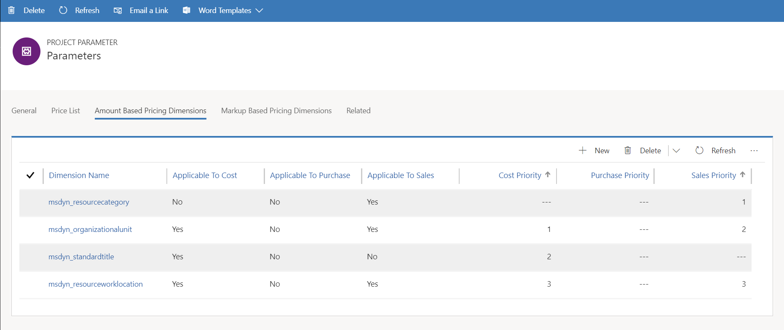
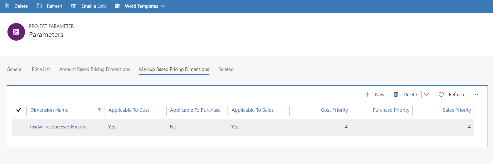

---
# required metadata

title: Set up custom fields as pricing dimensions
description: This topic provides information about how to set up pricing dimensions using custom fields. 
author: rumant
manager: AnnBe
ms.date: 09/18/2020
ms.topic: article
ms.prod: 
ms.service: project-operations
#

# optional metadata

# ms.search.form: 
# ROBOTS: 
audience: Application User
# ms.devlang: 
ms.reviewer: kfend
ms.search.scope: 
# ms.tgt_pltfrm: 
ms.custom: 
ms.assetid: 
ms.search.region: Global
ms.search.industry: Service industries
ms.author: rumant
ms.dyn365.ops.version: 
ms.search.validFrom: 2020-10-01
---

# Set up custom fields as pricing dimensions

_**Applies To:** Project Operations for resource/non-stocked based scenarios, Lite deployment - deal to proforma invoicing_

Before you begin, this topic assumes that you have completed the procedures in the topics, [Create custom fields and entities](create-custom-fields-entities-pricing-dimensions.md) and [Add required custom fields to price setup and transactional entities](add-custom-fields-price-setup-transactional-entities.md). If you haven't completed those procedures, go back and complete them and then return to this topic. 

This topic provides information about setting up custom pricing dimensions. On the **Parameters** page, the **Amount-Based Pricing Dimensions** tab shows the records in the pricing dimension entities. By default, there are two rows in the grid on this tab:

- **msdyn_resourcecategory** (Role)
- **msdyn_OrganizationalUnit** (Organizational Unit)

> [!IMPORTANT]
> Do not delete these rows. However, if you do not need them, you can make them not applicable in a specific context by setting **Applicable to Cost**, **Applicable to Sales**, and **Applicable to Purchase** all to **No**. Setting these attribute values to **No** has the same effect of not having the field as a pricing dimension.

For a field to become a pricing dimension, it must be:

- Created as a field in the **Role Price** and **Role Price markup** entities. For more information on how to do this, see [Add custom fields to price setup and transactional entities](add-custom-fields-price-setup-transactional-entities.md).

- Created as a row in the **Pricing Dimension** table. For example, add pricing dimension rows as shown in the following graphic. 

Resource Work hours (**msdyn_resourceworkhours**) is added as a markup-based dimension and has been added to the grid on the **Markup Based Pricing Dimension** tab.

> [!IMPORTANT]
> Any change to pricing dimension data in this table, existing or new, is propagated to the pricing business logic only after the cache is refreshed. The cache refresh time may take up to 10 minutes. Allow that length of time to see the changes in price defaulting logic that must result from changes to the Pricing Dimension data.

## Attributes of the Pricing Dimensions table
The following sections provide information about the different attributes in the **Pricing Dimensions** table.

### Pricing Dimension Name
This value should be the exact same as the schema name of the field that is added to the **Role Price** table for custom pricing dimensions. For more information about adding fields to the **Role Price** table, see [Add custom fields to price setup and transactional entities](add-custom-fields-price-setup-transactional-entities.md).

### Type of dimension
There are two types of pricing dimensions:
  
  - **Amount-based dimensions**: The dimension values from the input context are matched to the dimension values on **Role Price** line and the price/cost is defaulted directly from the **Role Price** table.
  - **Markup-based dimensions**: These are dimensions where the following three-step process to get the price/cost is used:
 
    1. The non-markup-based dimension values from the input context are matched to the Role Price line to get the base rate.
    2. The dimension values from the input context are matched to the **Role Price Markup** line to get a markup percentage.
    3. The markup percentage from the second step is applied to the base rate obtained from the **Role Price** table in the first step to arrive at final price/cost.
   
   The following table illustrates the calculation of price markups.
  
| Role        | Org Unit    |Work Location      |Standard Title      |Resource Work Hours      |  Mark Up|
| ------------|-------------|-------------------|--------------------|-------------------------|--------:|
|             | Contoso India|Onsite            |                    |Overtime                 |15     |
|             | Contoso India|Local             |                    |Overtime                 |10     |
|             | Contoso US   |Local             |                    |Overtime                 |20     |

If a resource from Contoso India whose base rate is 100 USD is working onsite, and they log 8 hours of Regular time and 2 hours of overtime on the time entry, the pricing engine will use the base rate of 100 for the 8 hours to record 800 USD. For the 2 hours overtime, a markup of 15% will be applied to the base rate of 100 to get a unit price of 115 USD and will record a total cost of 230 USD.

### Applicable to Cost 
If this is set to **Yes**, it indicates that the dimension value from the input context should be used to match to the **Role Price** and **Role Price Markup** when retrieving the cost and markup rates.

### Applicable to Sales
If this is set to **Yes**, it indicates that the dimension value from the input context should be used to match to the **Role Price** and **Role Price Markup** when retrieving the bill and markup rates.

### Applicable to Purchase
If this is set to **Yes**, it indicates that the dimension value from the input context should be used to match to the **Role Price** and **Role Price Markup** when retrieving the purchase price. Subcontracting scenarios are not supported, so this field is not used. 

### Priority
Setting the dimension priority helps pricing produce a price even when it can't find an exact match between the input dimension values and the values from the **Role Price** or **Role Price Markup** tables. In this scenario, null values are used for unmatched dimension values by weighing the dimensions in order of their priority.

- **Cost Priority**: The value of a dimension's cost priority will indicate the weight of that dimension when matching against the setup of cost prices. The value of **Cost Priority** must be unique across dimensions that are **Applicable to Cost**.
- **Sales Priority**: The value of dimension's sales priority will indicate the weight of that dimension when matching against the setup of sales prices or bill rates. The value of **Sales Priority** must be unique across dimensions that are **Applicable to Sales**.
