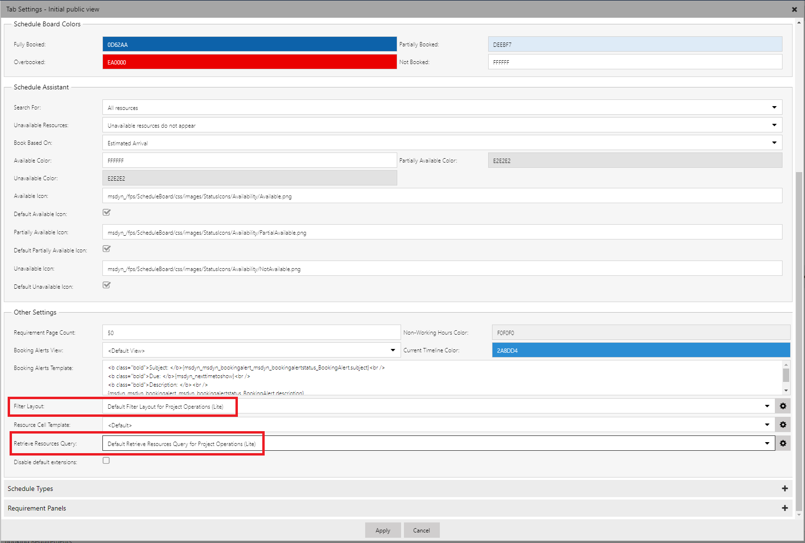

# Configure Schedule Board to show contract workers and subcontracted capacity 

[!include [banner](../../includes/dataverse-preview.md)]

_**Applies To:** Lite deployment - deal to proforma invoicing_

Schedule Board in Project Operations can be used for search for resources in 2 ways:

1. General resource search without the context of any specific project-based resource requirement.
2. Requirement – specific resource search where the project requirement will provide the context for the resources suggested

In order to make the schedule board aware of Subcontracted resource capacity and contract workers, the following updates must be made to the Schedule Board settings:

## Update Schedule Board settings for general resource search
### Update Filters for general resource search
When you try to search for a resource, the filters available on the schedule board should be updated so that you can ALSO search for external resources by specifying any or all of the following:
  - Worker type whether the resources shown should be contract workers or employees
  - Vendor company to which a resource should belong
  - Resources that belong to a specific subcontract or subcontract line
    
### Update retrieve resource query
The query used for searching should also be updated to use these additional filter attributes. Use the following steps to update Schedule Board configuration for general resource search:  
1. Open Schedule Board Settings for a specific Schedule Board
2. Open the **General settings** tab and scroll to **Other settings**
3. In the list of settings in this section, update the Filter Layout to **Default Filter Layout for Project Operations Lite**
4. Update **Retrieve Resources Query** to **Default Retrieve Resources Query for Project Operations Lite**.

  

## Update Schedule Board settings for requirement – based resource search
### Update Filters for requirement-specific resource search 
When you try to search for a resource, the filters available on the schedule board should be updated so that you can ALSO search for external resources by specifying any or all of the following:
 - Worker type whether the resources shown should be contract workers or employees
 - Vendor company to which a resource should belong
 - Resources that belong to a specific subcontract or subcontract line

### Update retrieve resource query for requirement-specific resource search: 
The query used for searching should also be updated to use these additional filter attributes. Use the following steps to update Schedule Board configuration for requirement – based resource search:

1. Open Schedule Board Settings for a specific Schedule Board and then click on **Open Default settings** to open the settings for requirement-specific search
2. Open the **General settings** tab and scroll to **Other settings**
3. In the list of settings in this section, update the Filter Layout to **Default Filter Layout for Project Operations Lite**.
4. Update **Retrieve Resources Query** to **Default Retrieve Resources Query for Project Operations Lite**.
5. Then open the tab **Schedule Types** and navigate to **Project**.
6. Under the settings for **Project**, update the **Schedule Assistant Retrieve Resources Query** to **Default Retrieve Resources Query for Project Operations Lite** and update **Schedule Assistant Retrieve Constraints Query** to **Default Retrieve Constraints Query for Project Operations Lite**.

  

[!INCLUDE[footer-include](../../includes/footer-banner.md)]
