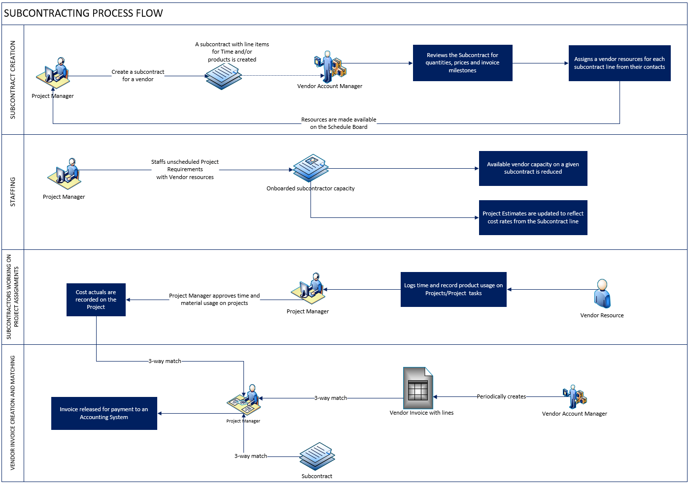

# Subcontract management in Project Operations

_**Applies To:** Lite deployment - deal to proforma invoicing_

Subcontracting in Microsoft Dynamics 365 Project Operations supports the following business process flow.

Here is a step-by-step description of the subcontracting process.

1. The project manager creates a subcontract with a vendor. By default, the price lists that are attached to the vendor record are used for the subcontract. The vendor account has a relationship type of **Vendor** or **Supplier**.
2. The project manager can itemize all the purchases as line items on the subcontract. Subcontract lines can be for time, expenses, or products. The transaction class that is selected on each subcontract line determines what the line is for.
3. The vendor account manager and the project manager can iterate over the subcontract. Pricing can be adjusted in the purchase price lists that are attached to the subcontract.
4. At this point or later in the process, if the subcontract line is for time, the vendor account manager associates contacts with each subcontract line. This association provides information to the project manager who is working on the subcontract. When a contact is associated with a subcontract line, the system automatically creates a bookable resource from the contact, if a bookable resource doesn't already exist.
5. The billing method on each subcontract line can be **Fixed Price** or **Time and Material**. For fixed-price subcontract lines, you can set up a milestone-based invoice schedule.

[!INCLUDE[footer-include](../../includes/footer-banner.md)]
