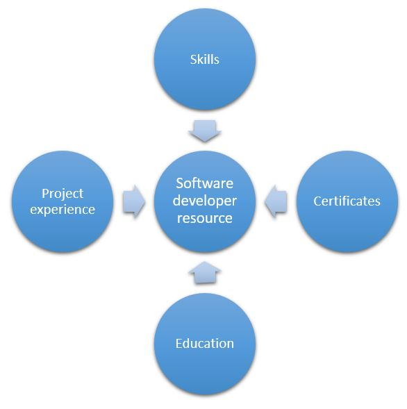

---
# required metadata

title: Create a new project
description: This topic provides information about how to create a new project.
author: Yowelle
ms.date: 09/01/2020
ms.topic: article
ms.prod: 
ms.technology: 

# optional metadata

ms.search.form: ProjProjectsListPage
# ROBOTS: 
audience: Application User
# ms.devlang: 
ms.reviewer: johnmichalak
ms.search.scope: Core, Operations
# ms.tgt_pltfrm: 
ms.custom: 82022
ms.assetid: bd2fb375-84c6-428a-8e54-f0f719045898
ms.search.region: Global
# ms.search.industry: 
ms.author: andchoi
ms.search.validFrom: 2016-02-28
ms.dyn365.ops.version: AX 7.0.0

---

# Create a new project

[!include [banner](../includes/banner.md)]

Complete the following steps to create a new project.

1. On the **Project management** page, select **New project**, and enter the following values:

    - **Project type:** Time and material
    - **Project name:** XYZ Upgrade Phase 2
    - **Project group:** TM\_WIP
    - **Project contract ID:** 00000002

2. Select **Create project**.

## Assign a resource to a project

1. On the **Workers** page, in the **Workers** list, select the record for the worker that you previously set up competencies for, and open the worker record.
2. On the Action Pane, on the **Project** tab, in the **Setup** group, select **Assign projects**.
3. On the **Resource validation project assignments** page, on the **Projects** tab, in the **Add the project to selected projects** field, filter on the **XYZ Upgrade Phase 2** project.
4. In the **Remaining projects** pane, select a project, and then select the arrow button to add it to the **Selected projects** pane.

You can also assign categories for a resource as you require. The category type is either **Cost** or **Revenue**. The category type is determined by your organization. If no categories are assigned for a resource, Finance looks up the default category on hour prices for cost and revenue.

## Set up project resource and role characteristics

A project manager can use the project resourcing functionality to create the roles that are required for the project. Roles can be used if confirmed resources are still unknown when resources are being reserved. Roles can be temporarily reserved as planned resources, so that you can continue the project planning stages.

 

**Scenario:** Contoso was hired to complete a Time and material project that has an approved project charter. The junior project manager is still completing the scope of the project. The resource manager is currently identifying specific resources that will be reserved to work on the new project. Because of the critical nature of the project, the project sponsor requested Senior project manager as one of the roles. The resource manager must acquire the new resource and define the role in the system in case the junior project manager requires the resource information during project planning.

The following steps show how the resource manager can set up the Senior project manager role and associate resource characteristics with it. Later, the role can be used to search for available resources that match the required resource competencies.

1. On the **Setup roles** page, select **New**, and enter the following values:

    - **Role ID:** Senior Project Manager
    - **Description:** Senior Project Manager

2. Select **Create**.
3. Select the **Senior Project Manager** role, and then select **Configure characteristics**.
4. In the **Characteristics type** field, select **Skill**.
5. In the **Available characteristics** field, enter the skill to search for.
6. In the **Characteristic type** field, select **Certificate**.
7. In the **Available characteristics** field, enter the certificate type to search for.

## Assign a project resource to a project

1. On the **All projects** page, select the **XYZ Upgrade Phase 2** project.
2. On the **Project team and scheduling** tab, select **Add**.
3. In the **Role** field, select **Team member**.
4. Select **Book from calendar**.
5. On the **Resource availability** page, select **View settings**.
6. On the **Adjust view settings** page, enter the following values:

    - **Format for date range view:** Day
    - **Display availability descriptions:** Yes
    - **Display remaining capacity:** Yes

7. In the list of resources, select a resource.
8. Select **Hard book** and **Full capacity**.

## Assign a resource to a default role

To help project or resource managers can drill down further on the resources that can be reserved for a project. You can associate a default role with an existing resource or a newly acquired resource. For example, when Daniel was hired, he had the experience and skills to fill the Business analyst role. The resource manager assigned this role as Daniel's default role. Therefore, the resource manager added Daniel to a pool of business analysts who are available to work on projects.

During resource reservation, project managers can filter the role resources that are available to work on projects. They can use this information as one criterion when they perform multi-criteria decision analysis during resource fulfillment. They can also add other resource characteristics to the filter to search for resources that have specific skills, education, and experience for a given project.

**Scenario:** An approved project has started, and the Senior project manager role was reserved as a planned resource during the project planning stage. The resource manager has now acquired a resource to fulfill the Senior project manager role.

1. On the **Resources list** page, select **Daniel Goldschmidt**.
2. On the **Resource role** page, select **New**, and enter the following values:

    - **Effective:** Enter the current date.
    - **Expiration:** Enter **Never**.
    - **Role:** Enter **Senior Project Manager**.

3. Select **Save**, and then close the page.
4. On the **Competencies** tab, add the **ProjectMgmt** skill and the **PMP** certificate.

[!INCLUDE[footer-include](../includes/footer-banner.md)]