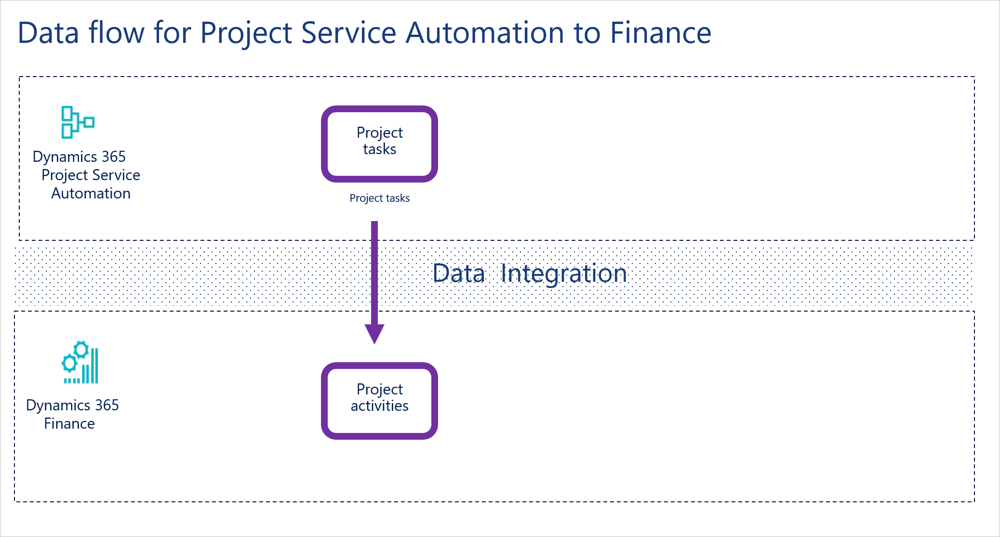
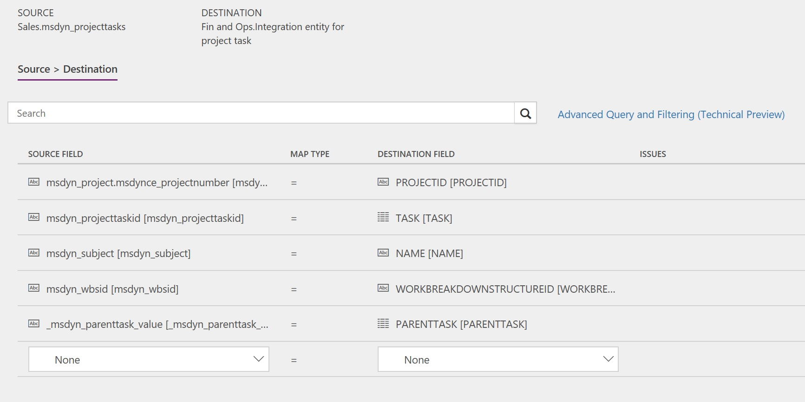

---
# required metadata

title: Synchronize project tasks directly from Project Service Automation to Finance and Operations
description: This article describes the template and underlying task that are used to synchronize project tasks directly from Microsoft Dynamics 365 Project Service Automation to Dynamics 365 Finance.
author: Yowelle
ms.date: 07/20/2018
ms.topic: article
ms.prod: 
ms.technology: 

# optional metadata

# ms.search.form: 
# ROBOTS: 
audience: Application User
# ms.devlang: 
ms.reviewer: johnmichalak

# ms.tgt_pltfrm: 
ms.custom: 87983
ms.assetid: b454ad57-2fd6-46c9-a77e-646de4153067
ms.search.region: Global
# ms.search.industry: 
ms.author: andchoi
ms.search.validFrom: 2016-11-28
ms.dyn365.ops.version: AX 7.3.0

---

# Synchronize project tasks directly from Project Service Automation to Finance and Operations

[!include[banner](../includes/banner.md)]

This article describes the template and underlying task that are used to synchronize project tasks directly from Dynamics 365 Project Service Automation to Dynamics 365 Finance.

> [!NOTE]
> - Project task integration, expense transaction categories, hour estimates, expense estimates, and functionality locking are available in version 8.0.
> - If you're using Enterprise edition 7.3.0, after you install KB 4132657 and KB 4132660, you will be able to use the templates to integrate project tasks, expense transaction categories, hour estimates, expense estimates, and actuals, and to configure functionality locking. If you must reset the accounting distributions, we recommended that you also install KB 4131710.
> - Actuals integration is available in version 8.0.1 or later.

## Data flow for Project Service Automation to Finance

The Project Service Automation to Finance integration solution uses the Data integration feature to synchronize data across instances of Project Service Automation and Finance. The integration template that is available with the Data integration feature enables the flow of data about project tasks from Project Service Automation to Finance.

The following illustration shows how the data is synchronized between Project Service Automation and Finance.

## Template and task

To access the template, in the Microsoft Power Apps admin center, select **Projects**, and then, in the upper-right corner, select **New project** to select public templates.

The following template and underlying task are used to synchronize project tasks from Project Service Automation to Finance:

- **Name of the template in Data integration:** Project tasks (PSA to Fin and Ops)
- **Name of the task in the project:** Project tasks

Before synchronization of project tasks can occur, you must synchronize project contracts and projects.

## Entity set

| Project Service Automation | Finance                             |
|----------------------------|-------------------------------------|
| Project Tasks              | Integration entity for project task |

## Entity flow

Project tasks are managed in Project Service Automation, and they are synchronized to Finance as project activities.

## Prerequisites and mapping setup

Before synchronization of project tasks can occur, you must synchronize project contracts and projects.

## Power Query

You must use Microsoft Power Query for Excel to filter data if this condition is met:

- You have resource-specific records in a project task.

If you must use Power Query, follow this guideline:

- The Project tasks (PSA to Fin and Ops) template has a default filter that excludes resource-specific records from a project task by setting the filter on **IsLineTask** to **False**. If you create your own template, you must add this filter.

## Template mapping in Data integration

The following illustration shows an example of the template task mappings in Data integration. The mapping shows the field information that will be synchronized from Project Service Automation to Finance.

[!INCLUDE[footer-include](../includes/footer-banner.md)]