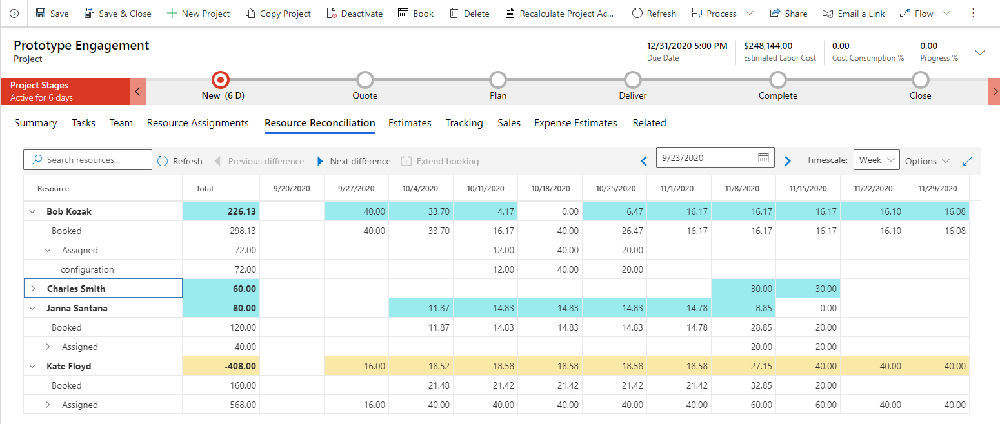
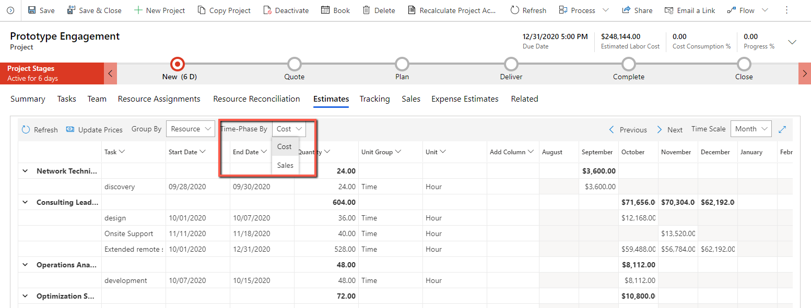

---
# required metadata

title: Navigating the user interface
description: This topic provides information about Project management in Dynamics 365 Project operations. 
author: ruhercul
manager: AnnBe
ms.date: 10/01/2020
ms.topic: article
ms.service: dynamics-project-operations
ms.reviewer: kfend
ms.author: suvaidya

---

# Navigating the user interface

## Overview

The main project form is separated into several tabs. Each tab represents a different level of detail within the project.

- **Summary** – Provides a description of the project and aggregates both the planned and actual project performance.

    

- **Tasks** - Provides the details regarding the work breakdown structure represented by a grid view, board view, and a gantt.

    

- **Team** - Provides details regarding the project participants. The assigned effort of each team member is also summarized in this view.

    

- **Resource assignments** – Provides a time-phased view of the effort for each resource on a project.

    

- **Resource reconciliation** – Provides a time-phased view of the differences between the assignments of each named resource and their bookings.

    

- **Estimates** – Provides a time-phased view of the both the cost and sales estimates of a project.

    

- **Tracking** – Provides a view which shows the progress of tasks in the work breakdown structure for effort, cost, and sales.

    

- **Sales –** Provides deep links to quotes and contracts associated with the project.

- **Expense Estimates –** Provides a grid that defines project expenses based upon organizational expense categories.

    

## Grid controls

The follow is a brief overview of the typical controls found in the various project planning tabs.

### Refresh

The **Refresh** action retrieves the latest data from the server if any changes have occurred after the grid has been initially loaded.

### Group by

The **Group by** action updates the grouping of the rows in the grid to reflect either resources, roles, or categories based on the user's needs.

### Previous/Next

**Previous**/**Next** update the visible time periods on the time-phased grids.

### Timescale

**Timescale** allows users to change the aggregation of the time-phased data between days, weeks, months, and years.

### Expand

The **Expand** action renders the visible grid to full screen providing more ability to see additional roles.

### Time-phase by

**Time-phase by** updates the grouping of the rows in the grid to reflect either cost estimates for sales estimates, as opposed this control applies to the estimate script and the tracking grid.

### Add column

In the grids, **Add column** allows the user to define the visible columns in the grid. Please note, only out-of-the-box columns can be added to the grids in the project planning form.

