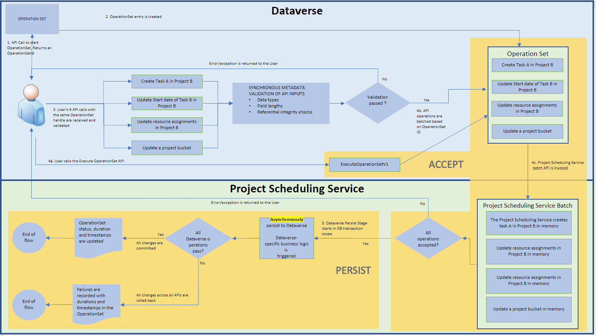
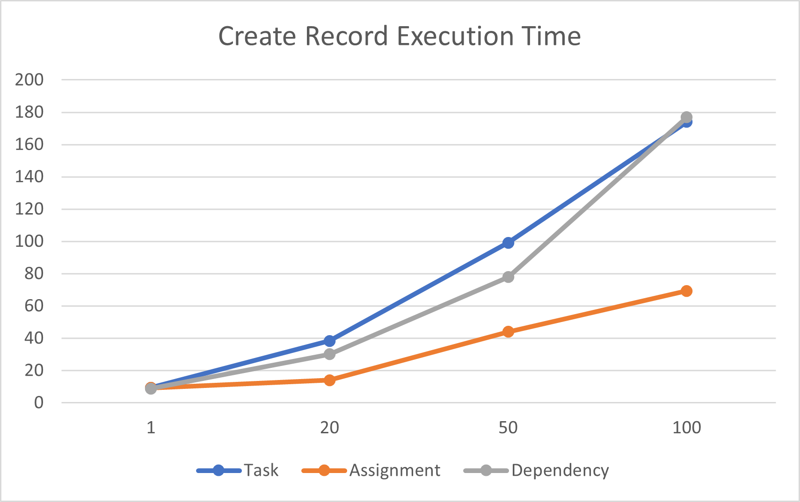
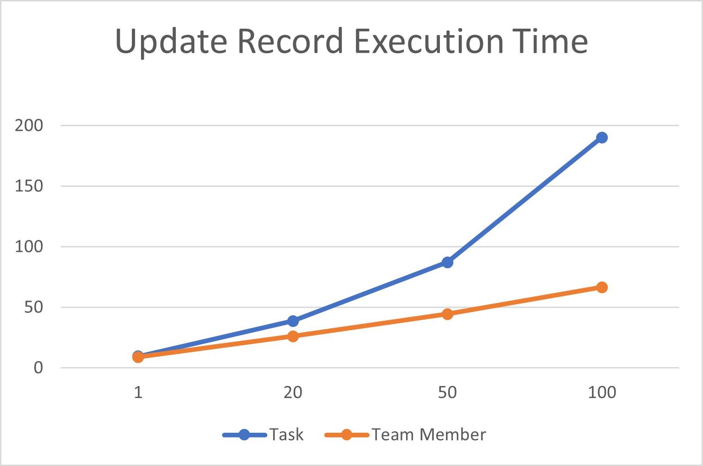
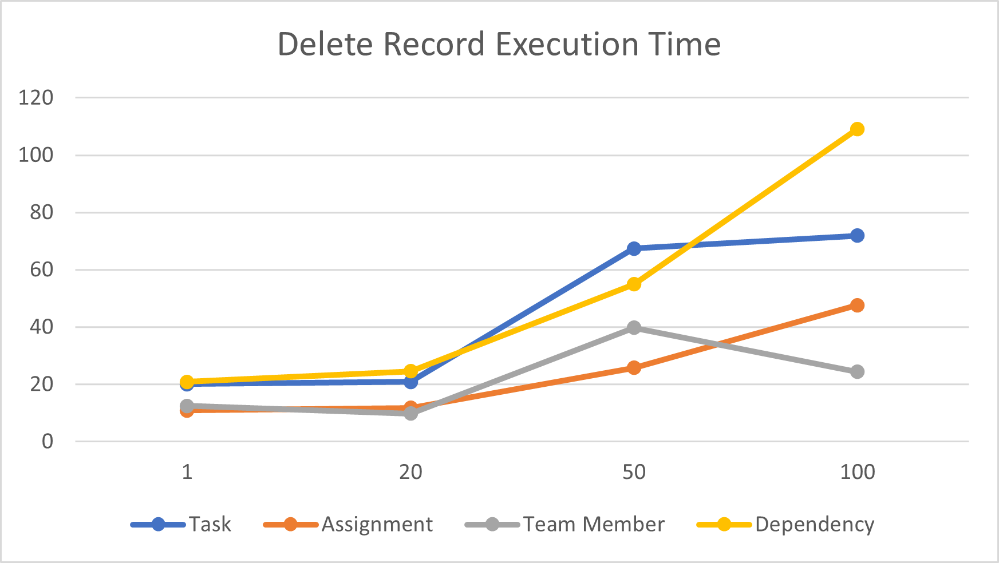

# Project schedule API performance

_**Applies To:** Project Operations for resource/non-stocked based scenarios, Lite deployment - deal to proforma invoicing, Project for the web_

This topic provides information about the performance benchmarks of the Project schedule application programming interfaces (APIs) and identifies the best practices for optimizing usage.

## Project Scheduling Service
The Project Scheduling Service is a multi-tenant service that runs in Microsoft Azure. It's designed to improve interaction by providing a fast and fluid experience when users work on projects. This improvement is achieved by accepting change requests, processing them, and then immediately returning the result. The service asynchronously persists to Dataverse and doesn't block users from performing other operations.

The Project schedule APIs rely on the Project Scheduling Service to run requests that are described in more detail in later sections of this topic.

The Project schedule APIs are designed to work with the following work breakdown structure (WBS) entities:

  - Project
  - Project Task
  - Project Task Dependency
  - Project Team Member
  - Resource Assignment
  
Both out-of-box fields and custom fields are supported. Unless otherwise noted, all common operations are supported, such as create, update, and delete. For more information, see [Use Project schedule APIs to perform operations and scheduling entities](schedule-api-preview.md).

As part of the Project schedule APIs, a unit-of-work pattern has been added. This pattern is known as an OperationSet, and it can be used when several requests must be processed in a single transaction.

The following illustration shows the flow that a partner will experience when this feature is used.

**Step 1**: A client makes an API call to an Open Data Protocol (OData) endpoint in Dataverse to create an OperationSet.

**Step 2**: After the new OperationSet is created, an **OperationSetId** value is returned.

**Step 3**: The client uses the **OperationSetId** value to make another Project schedule API request. The result is a create, update, or delete request on a scheduling entity. When this request is made, metadata validation is done. If the validation fails, the request is terminated, and an error is returned.

**Steps 4a–4c**: These steps represent the ACCEPT phase. The client calls the **ExecuteOperationSetV1** API, which sends all the changes to the Project Scheduling Service in one batch. The Project Scheduling Service runs its own validations on requests in the batch. Any validation failures undo the batch and return an exception to the caller. If the batch is successfully accepted by the Project Scheduling Service, the OperationSet status is updated to reflect the fact that the OperationSet is being processed by the Project Scheduling Service.

**Step 5**: This step represents is the PERSIST phase. The Project Scheduling Service asynchronously writes the batch to Dataverse in a transaction. If the write operation is successful, the OperationSet is marked as **Completed**. Any errors roll back the transaction and the batch, and the OperationSet is marked as **Failed**.

## Performance methodology
Execution time is defined as the time from the call to the **ExecuteOperationSetV1** API until the Project Scheduling Service has finished writing to Dataverse. All operations run a combined 2,200 times, and the P99 execution time measurements are reported. Single-record and bulk operations are measured.

For a single-record operation, the OperationSet contains one request. For bulk operations, it contains 20, 50, or 100 requests. Each bulk size is reported separately.

These operations run on a UR 15 Project Operations Lite deployment in North America.

## Results
### Create operations
#### Single-record create operations
The following table shows the execution times for the creation of a single record. The times are in seconds.

<table class="tg">
<thead>
  <tr>
    <th class="tg-0lax" rowspan="2">Record&nbsp;&nbsp;&nbsp;type</th>
    <th class="tg-0lax" colspan="2">Time</th>
  </tr>
  <tr>
    <th class="tg-0lax">Required fields</th>
    <th class="tg-0lax">All supported fields</th>
  </tr>
</thead>
<tbody>
  <tr>
    <td class="tg-0lax">Project</td>
    <td class="tg-0lax">2.5</td>
    <td class="tg-0lax">3.78</td>
  </tr>
  <tr>
    <td class="tg-0lax">Task</td>
    <td class="tg-0lax">8.82</td>
    <td class="tg-0lax">9.34</td>
  </tr>
  <tr>
    <td class="tg-0lax">Assignment</td>
    <td class="tg-0lax">9.19</td>
    <td class="tg-0lax">9.19</td>
  </tr>
  <tr>
    <td class="tg-0lax">Team member</td>
    <td class="tg-0lax">0.84</td>
    <td class="tg-0lax">4.2</td>
  </tr>
  <tr>
    <td class="tg-0lax">Dependency</td>
    <td class="tg-0lax">8.84</td>
    <td class="tg-0lax">8.84</td>
  </tr>
</tbody>
</table>

#### Bulk create operations
The following table shows the execution times for the creation of many records. Specifically, Microsoft measured the execution times for the creation of 20, 50, and 100 records in a single OperationSet. The times are in seconds.

<table class="tg">
<thead>
  <tr>
    <th class="tg-0lax" rowspan="3">Record&nbsp;&nbsp;&nbsp;type</th>
    <th class="tg-0lax" colspan="6">Time</th>
  </tr>
  <tr>
    <th class="tg-0lax" colspan="2">20 records</th>
    <th class="tg-0lax" colspan="2">50 records</th>
    <th class="tg-0lax" colspan="2">100 records</th>
  </tr>
  <tr>
    <th class="tg-0lax">Required fields</th>
    <th class="tg-0lax">All supported fields</th>
    <th class="tg-0lax">Required fields</th>
    <th class="tg-0lax">All supported fields</th>
    <th class="tg-0lax">Required fields</th>
    <th class="tg-0lax">All supported fields</th>
  </tr>
</thead>
<tbody>
  <tr>
    <td class="tg-0lax">Task</td>
    <td class="tg-0lax">19.92</td>
    <td class="tg-0lax">38.35</td>
    <td class="tg-0lax">36.67</td>
    <td class="tg-0lax">99.13</td>
    <td class="tg-0lax">116.77</td>
    <td class="tg-0lax">174.06</td>
  </tr>
  <tr>
    <td class="tg-0lax">Assignment</td>
    <td class="tg-0lax">13.94</td>
    <td class="tg-0lax">13.94</td>
    <td class="tg-0lax">43.95</td>
    <td class="tg-0lax">43.95</td>
    <td class="tg-0lax">69.38</td>
    <td class="tg-0lax">69.38</td>
  </tr>
  <tr>
    <td class="tg-0lax">Dependency</td>
    <td class="tg-0lax">30.04</td>
    <td class="tg-0lax">30.04</td>
    <td class="tg-0lax">77.82</td>
    <td class="tg-0lax">77.82</td>
    <td class="tg-0lax">176.89</td>
    <td class="tg-0lax">176.89</td>
  </tr>
</tbody>
</table>

> [!NOTE] 
> Bulk create operations on the **Project** and **Team Member** entities aren't included in this table, because the runtime for those operations resembles the runtime when the API for creating a single record is called multiple times. These APIs are run immediately in Dataverse.

The following illustration shows a plot of the execution times for the **Task**, **Assignment**, and **Dependency** entities when 20, 50, and 100 records are created and all the supported fields are used.

### Update operations
#### Single-record update operations
The following table shows the execution times for updates of a single record. The times are in seconds.

<table class="tg">
<thead>
  <tr>
    <th class="tg-0lax" rowspan="2">Record&nbsp;&nbsp;&nbsp;type</th>
    <th class="tg-0lax" colspan="2">Time</th>
  </tr>
  <tr>
    <th class="tg-0lax">Required fields </th>
    <th class="tg-0lax">All supported fields</th>
  </tr>
</thead>
<tbody>
  <tr>
    <td class="tg-0lax">Project</td>
    <td class="tg-0lax">9.53</td>
    <td class="tg-0lax">13.91</td>
  </tr>
  <tr>
    <td class="tg-0lax">Task</td>
    <td class="tg-0lax">8.82</td>
    <td class="tg-0lax">9.91</td>
  </tr>
  <tr>
    <td class="tg-0lax">Team member</td>
    <td class="tg-0lax">9</td>
    <td class="tg-0lax">8.96</td>
  </tr>
</tbody>
</table>

> [!NOTE]
> Update operations on the **Resource Assignments** and **Project Task Dependency** entities aren't supported.

#### Bulk update operations
The following table shows the execution times for updates of many records. Specifically, Microsoft measured the execution times for updates of 20, 50, and 100 records in a single OperationSet. The times are in seconds.

<table class="tg">
<thead>
  <tr>
    <th class="tg-0lax" rowspan="3">Record&nbsp;&nbsp;&nbsp;type</th>
    <th class="tg-0lax" colspan="6">Time</th>
  </tr>
  <tr>
    <th class="tg-0lax" colspan="2">20 records</th>
    <th class="tg-0lax" colspan="2">50 records</th>
    <th class="tg-0lax" colspan="2">100 records</th>
  </tr>
  <tr>
    <th class="tg-0lax">Required fields</th>
    <th class="tg-0lax">All supported fields</th>
    <th class="tg-0lax">Required fields</th>
    <th class="tg-0lax">All supported fields</th>
    <th class="tg-0lax">Required fields</th>
    <th class="tg-0lax">All supported fields</th>
  </tr>
</thead>
<tbody>
  <tr>
    <td class="tg-0lax">Task</td>
    <td class="tg-0lax">8.91</td>
    <td class="tg-0lax">38.71</td>
    <td class="tg-0lax">20.92</td>
    <td class="tg-0lax">87.13</td>
    <td class="tg-0lax">36.68</td>
    <td class="tg-0lax">190.34</td>
  </tr>
  <tr>
    <td class="tg-0lax">Team member</td>
    <td class="tg-0lax">20.52</td>
    <td class="tg-0lax">26.06</td>
    <td class="tg-0lax">41.93</td>
    <td class="tg-0lax">44.51</td>
    <td class="tg-0lax">38.63</td>
    <td class="tg-0lax">66.53</td>
  </tr>
</tbody>
</table>

> [!NOTE]
> Update operations on the **Resource Assignments** and **Project Task Dependency** entities aren't supported.

The following illustration shows a plot of the execution times for the Task and Team Member entities when 20, 50, and 100 records are updated and all the supported fields are used.

### Delete operations
#### Single-record delete operations
The following table shows the execution times for the deletion of a single record. The times are in seconds.

| Record type | Time  |
|-------------|-------|
| Task        | 20.12 |
| Assignment  | 10.86 |
| Team member | 12.52 |
| Dependency  | 20.89 |

> [!NOTE]
> Delete operations on the **Project** entity aren't supported.

#### Bulk delete operations
The following table shows the execution times for the deletion of many records. Specifically, Microsoft measured the execution times for the deletion of 20, 50, and 100 records in a single OperationSet. The times are in seconds.

<table class="tg">
<thead>
  <tr>
    <th class="tg-0lax" rowspan="2">Record&nbsp;&nbsp;&nbsp;type</th>
    <th class="tg-0lax" colspan="3">Time</th>
  </tr>
  <tr>
    <th class="tg-0lax">20 records</th>
    <th class="tg-0lax">50 records</th>
    <th class="tg-0lax">100 records</th>
  </tr>
</thead>
<tbody>
  <tr>
    <td class="tg-0lax">Task</td>
    <td class="tg-0lax">20.91</td>
    <td class="tg-0lax">67.43</td>
    <td class="tg-0lax">71.96</td>
  </tr>
  <tr>
    <td class="tg-0lax">Assignment</td>
    <td class="tg-0lax">11.75</td>
    <td class="tg-0lax">25.79</td>
    <td class="tg-0lax">47.66</td>
  </tr>
  <tr>
    <td class="tg-0lax">Team member</td>
    <td class="tg-0lax">9.78</td>
    <td class="tg-0lax">39.73</td>
    <td class="tg-0lax">24.33</td>
  </tr>
  <tr>
    <td class="tg-0lax">Dependency</td>
    <td class="tg-0lax">24.61</td>
    <td class="tg-0lax">54.9</td>
    <td class="tg-0lax">109.16</td>
  </tr>
</tbody>
</table>

> [!NOTE]
> Delete operations on the **Project** entity aren't supported.

The following illustration shows a plot of the execution times for the **Task**, **Assignment**, **Team Member**, and **Dependency** entities when 20, 50, and 100 records are deleted.

## Observations
For each record operation, the **ExecuteOperationSet** API takes about 800 milliseconds to send a request to the Project Scheduling Service. The Project Scheduling Service then takes about five seconds to process the payload and call Dataverse. The rest of the execution time is spent running business logic and writing data to the database in Dataverse.

When 100 records are created, updated, or deleted, the **ExecuteOperationSet** API takes about three seconds to send the request to the Project Scheduling Service. The Project Scheduling Service then takes about five seconds to process the requests and call Dataverse. Bulk operations must pay a **Project Scheduling Service tax** one time, for all the records in the OperationSet. Therefore, bulk operations have a significantly lower average execution time than single-record operations.

## Scenarios
The following table shows the execution times when the Project schedule APIs are used to accomplish specific scenarios. The times are in seconds.

| Scenario                                                                   | Time  |
|----------------------------------------------------------------------------|-------|
| Create a project that has 40   tasks.                                      | 36.01 |
| Create   a project that has 40 tasks and 20 dependencies.                  | 38.11 |
| Create   a project that has 40 tasks and 30 assignments.                   | 60.17 |
| Create a   project that has 40 tasks, 20 dependencies, and 30 assignments. | 60.27 |

## Best practices
Based on the preceding scenario results, the APIs perform better in the following conditions:

  - Group as many operations together as possible. The average runtime for bulk operations is better than the average runtime for single-record operations. The smaller the number of OperationSets in use, the faster the average execution time will be.
  - Set only the minimum attributes that are required to accomplish your scenario. Be selective about the types of non-required fields included in an OperationSet request. Fields that contain foreign keys or rollup fields will negatively affect performance.
