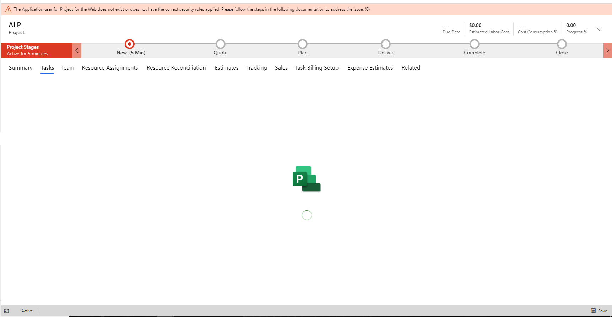

# Troubleshoot working in the Task grid 

_**Applies To:** Project Operations for resource/non-stocked based scenarios, Lite deployment - deal to proforma invoicing_

The following items address commonly observed issues related to users being unable to either read or write tasks in Dynamics 365 Project Operations.

## Enable cookies

Project Operations requires third-party cookies be enabled in order render the work breakdown structure. When third-party cookies aren't enabled, instead of seeing tasks, you will see a blank page when you select the **Tasks** tab on the **Project** page.

### Workaround
For Microsoft Edge or Google Chrome browsers, the following procedures outline how to update your browser setting to enable third-party cookies.

#### Microsoft Edge

1. On your computer, open your Edge browser.
2. In the top right corner, click **…** > **Settings**.
3. Under **Cookies and site permissions**, select **Cookies and site data**.
4. Turn off **Block third-party cookies**.

#### Google Chrome

1. On your computer, open your Chrome browser.
2. In the top right corner, select the three vertical dots, and then select **Settings**.
3. Under **Privacy and security**, select **Cookies and other site data**.
4. Select the **Allow all cookies** radio button.

> [!IMPORTANT]
> If you block third-party cookies, all cookies and site data from other sites will be blocked, even if the site is allowed on your exceptions list.

## PEX Endpoint

Project Operations requires that a project parameter reference the PEX Endpoint. This endpoint is required to communicate with the service used to render the work breakdown structure. IF the parameter isn't enabled, you will receive an error. 

## Workaround
 

1. Add the **PEX Endpoint** field to the **Project Parameters** page.
2. Update the field with the following value: `https://project.microsoft.com/<lang>/?org=<cdsServer>#/taskgrid?projectId=\<id>&type=2`
3. Remove the field from the **Project Parameters** page.

## Privileges for Project for the Web

Project Operations relies on an external scheduling service with an application user that requires several roles to read and write to entities related to the work breakdown structure; including but not limited to **project task** s, **resource assignments** and **task dependencies**. If a user is unable to render the work breakdown structure when they navigate to the task tab is likely the issues stems from Project for Project Operations has not been enabled for the user.

## Workaround

1. Navigate to **Setting** > **Security** > **Users** > **Application Users**.  

   
   
2. Double-click the application user record to verify that:

 - The user has access to the project. This verification is typically done by ensuring that the user has **Project Manager** security role.
 - The Microsoft Project application user exists and is configured correctly.
 
3. If this user doesn't exist, you can create a new user record. Select **New Users**, change the entry form to **Application User** and add the **Application ID**.

   

4. Verify that the user has been assigned the correct license and that the service is enabled in the service plans details of the license.
5. Verify that the user can open project.microsoft.com.
6. Verify through the project parameters that the system is pointing to the correct project endpoint.
7. Verify that the project application user is created as stated above.
8. Apply the following security roles to the user:

  - Common Data Service User
  - Project Operations System
  - Project System

## Error when updating the Work breakdown structure

When one or more updates are made to the work breakdown structure, the changes eventually fail and aren't saved. An error occurs in the schedule grid.

## Workaround

1. Verify that the user has been assigned the correct license and that the service is enabled in the service plans details of the license
2. Verify that the user can open project.microsoft.com
3. Verify that the system is pointing to the correct project endpoint, see above.
4. Verify that the Project Application user has been created, see above.
5. Apply the following security roles to the user:
  
  - Common data service user or Base user
  - Project Operations System
  - Project System
  - Project Operations Dual Write System (This role is required if you are deploying the resource/non-stocked based scenario of Project Operations.)
