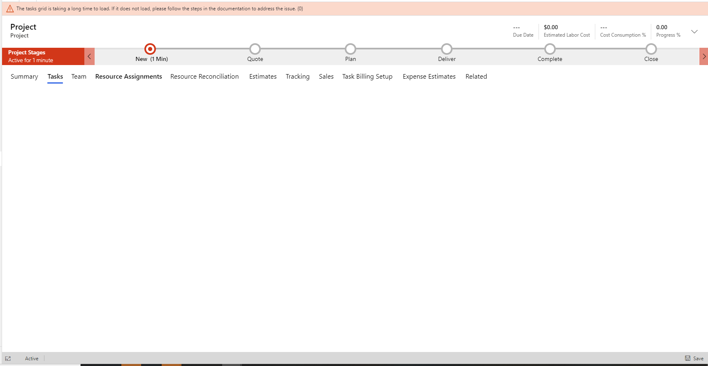
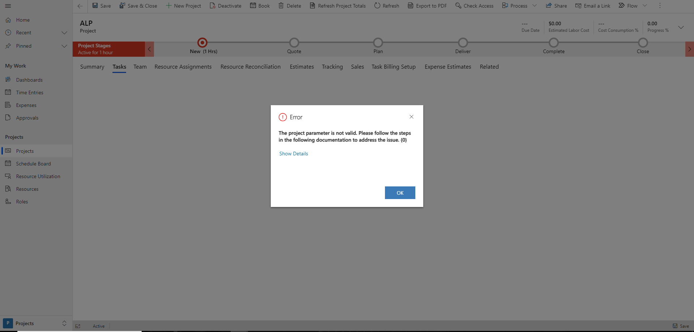
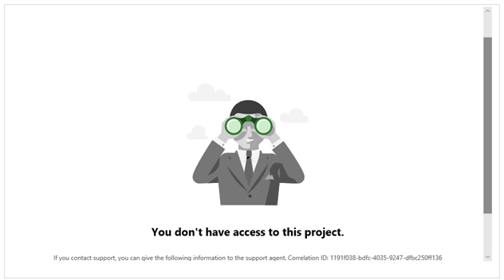

# Troubleshooting Guide for the Task Grid 

_**Applies To:** Project Operations for resource/non-stocked based scenarios, Lite deployment - deal to proforma invoicing, Project Operations for stocked/production-based scenarios_

## Overview

The following items address commonly observed issues related to users being unable to either read or write tasks in Project Operations.

# Enabling Cookies

## Description

Project Operations requires third party cookies enabled in order render the work breakdown structure. When third party cookies are disabled, users will see a blank tab where the tasks should be rendered.

_Figure 1 Blank tab when third party cookies are not enabled_

## Mitigation
 ### On Edge

1. On your computer, open Edge
2. At the top right, click … \&gt; Settings
3. Under &quot;Cookies and site permissions&quot;, click Cookies and other site data
4. Turn off &quot;Block third-party cookies&quot;

### On Chrome

1. On your computer, open Chrome.
2. At the top right, click More Settings.
3. Under &quot;Privacy and security,&quot; click Cookies and other site data.
4. Select &quot;Allow all cookies&quot;

Important: If you block third-party cookies, all cookies and site data from other sites will be blocked, even if the site is allowed on your exceptions list.

# PEX Endpoint

## Description

Project Operations requires the project parameter to reference the PEX Endpoint. This endpoint is required to communicate with the service used to render the work breakdown structure.

_Figure 2 Error displayed when the project parameter value is incorrect or null_

## Mitigation
 

_Figure 3 PEX Endpoint field on the project parameter_

1. Add the PEX Endpoint field to the project parameter form
2. Update the field with the following value: **https://project.microsoft.com/\&lt;lang\&gt;/?org=\&lt;cdsServer\&gt;#/taskgrid?projectId=\&lt;id\&gt;&amp;type=2**
3. Remove the field from the project parameter form

# Privileges for Project for the Web

## Description

Project Operations relies upon an external scheduling service with an application user that requires several roles to read and write to entities related to the work breakdown structure; including but not limited to **project task** s, **resource assignments** and **task dependencies**. If a user is unable to render the work breakdown structure when they navigate to the task tab is likely the issues stems from Project for Project Operations has not been enabled for the user.

_Figure 4 The Error displayed on the project form_

_Figure 5 User Error: You don&#39;t have access to this project_

## Mitigation
 
 Screenshot of mitigation area

1. Verify that the user does in fact have access to the project, this is typically done by ensuring that the user has **Project Manager** security role.

2. Verify that the Microsoft Project application user exists and is configured correctly
 

 If this user does not exist you are able to create with by selecting &quot;New Users&quot; changing the entry form to &quot;Application User&quot; and adding the Application ID, complete the data as shown.

1. Verify that the user has been assigned the correct license and that the service is enabled in the service plans details of the license
2. Verify that the user can open project.microsoft.com
3. Verify that the system is pointing to the correct project endpoint, via project parameters
4. Verify that the Project Application user is created as above.
5. Apply the following security roles to the user:

  1. Common data service user or Base user
  2. Project Operations System
  3. Project System

# Work breakdown structure change failures

## Description

When a user makes one or many changes to the work breakdown structure, the changes eventually fail and do not save to CDS. An error is surfaced in the schedule grid.

**Screen Shot of Problem (should include dialog)**

**Text of Problem if applies in Modproj UI**

**Text of warning in CRM**

Mitigation
 Screenshot of mitigation area

1. Verify that the user has been assigned the correct license and that the service is enabled in the service plans details of the license
2. Verify that the user can open project.microsoft.com
3. Verify that the system is pointing to the correct project endpoint, see above.
4. Verify that the Project Application user has been created, see above.
5. Apply the following security roles to the user:
  1. Common data service user or Base user
  2. Project Operations System
  3. Project System
  4. For customer who are deploying the resource/non-stocked based scenario, Project Operations Dual Write System
