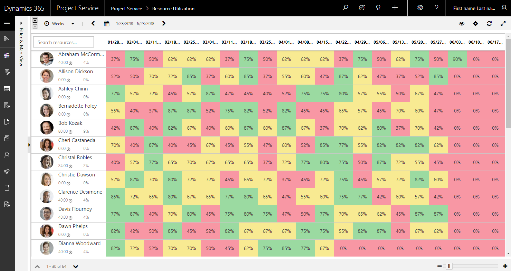
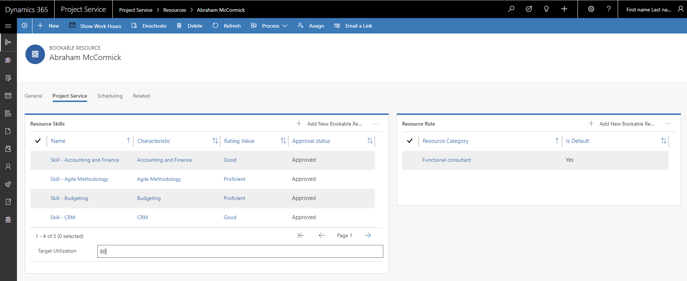
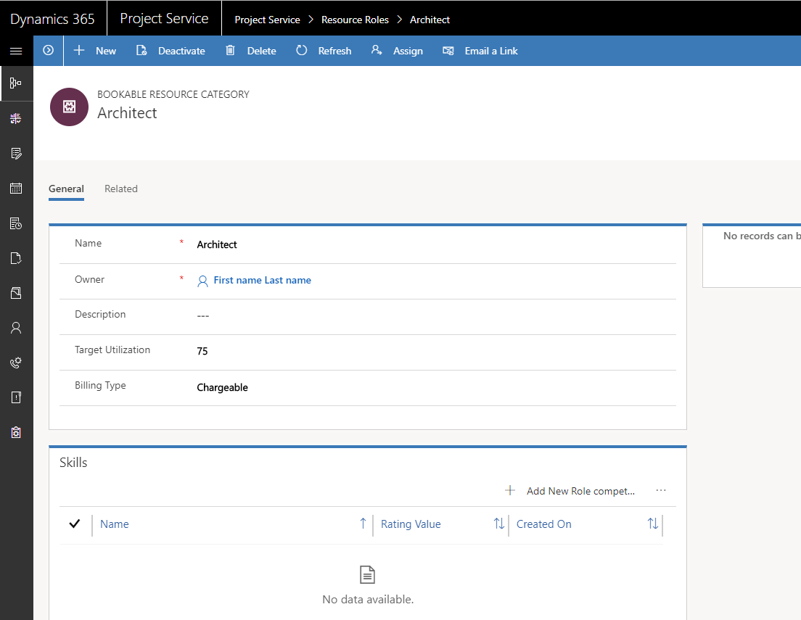

# View chargeable utilization for resources
 
The **Utilization View** on the **Project Service Resource Utilization** page shows the chargeable utilization for each bookable resource. Because the view is based on the schedule board, you’ll find many of the same functions.

> 
 

The chargeable utilization calculation works as follows:

   Chargeable utilization = (Chargeable actual hours) / (resource capacity)

The cells represent the calculated chargeable utilization for the selected period (days, weeks, or months).

The colors in each cell show the chargeable utilization for a resource as compared to their target chargeable utilization. 

The target utilization can be set on the resource’s default role or on the individual resource itself. The calculation looks at the individual for the target first, and then to the resource’s default role.

## Set target on a resource

1. Go to **Resources** \> **Resources**. 
2. Select a resource to open the record. 
3. On the **Project Service** tab, you can set the resource’s target utilization.

> 
 
## Set target utilization on a role

1. Go to **Resources** \> **Resource Roles**. 
2. Select a role and open the record. 
3. Set the target utilization for the role.

> 
 
## Calculate chargeable utilization for a resource

To calculate chargeable utilization for a resource, you will need to complete some pre-requisites. 

### Set default role for individual resource

First, the target utilization must be set on either the individual resource or on resource roles. If you are using resource roles for targets, each individual resource must have a default role. 

1. To set this, go to **Resources** \> **Resources**. 
2. Select a resource, open the record, and then select the **Project Service** tab. 
3. In the **Resource Role** grid, make sure there’s one role for the resource and **Is Default** is set to **Yes**.
 
### Change billing type for resource role

The resource roles must be set to have a billing type of **Chargeable**. 

1. Go to **Resources** \> **Resource Roles**. 
2. Open the record you want to update, and then set the billing type default to **Chargeable**.

### Set working hours for resource role
 
The resource must have working hours for the capacity calculation. 

1. Go to **Resources** \> **Resources**. 
2. Select a resource to open the record, and then select **Show Work Hours**. 
3. You can bulk-update the list of resources by applying a **Work Hour Template** from the **Resource List** view.

## Troubleshooting chargeable actual hours

The chargeable actual hours are sourced from the **Actuals** entity. Actuals with a billing type of **Chargeable** are included in the calculation and, for this reason, you must have projects where the actuals that are chargeable.

If you are not seeing chargeable utilization, here are some things you can check:

- The resource has working hours defined for capacity.
- The resource has either an individually defined utilization target or has a default role assigned to it. The role has a utilization target defined for it.
- Actuals have a billing type of **Chargeable** for the period you are expecting a utilization calculation for. Check the following if you are seeing actuals with billing types other than chargeable:

  - The role used on the actual has a default billing type of something other than chargeable.
  - The role on the project contract line backing the project has been set to non-chargeable.
  - The project does not have an associated contract line.

