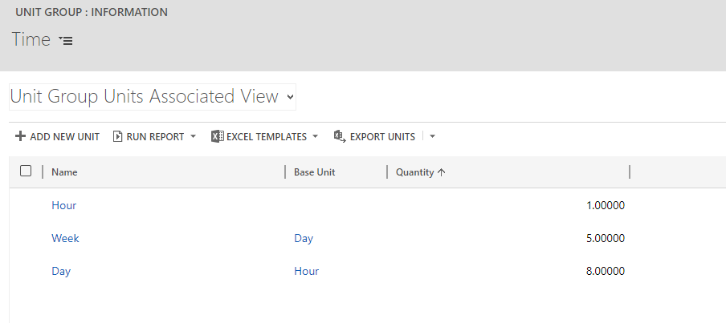

# Unit groups and units

[!include [banner](../includes/psa-now-project-operations.md)]

[!INCLUDE[cc-applies-to-psa-app-3.x](../includes/cc-applies-to-psa-app-3x.md)]

Unit groups and units are basic entities in Microsoft Dynamics 365. A unit is a single unit of measure, and multiple units can be grouped into unit groups. A unit group is sometimes referred to as a unit schedule in the Dynamics 365 user interface (UI). 

Here are some examples of units and unit groups:
 
- **Unit group**: Distance 
	- **Units**: Mile, Kilometer, and so on.
- **Unit group**: Time
	- **Units**: Hour, day, week, and so on. 

When you set up multiple units in a unit group, you must also set up a conversion factor between them by designating the first unit that you set up as the default or primary unit for the unit group. 

For example, in a **Time** unit group, if you set up **Hour** as the first unit, the system designates **Hour** as the default unit. If the next unit that you set up is **Day**, you must set up a conversion factor for **Day** to **Hour**. If you then add **Week** as a third unit, you must set up a conversion factor for **Week** in terms of **Day** or **Hour**. 

The following image shows an example setup for the **Day** unit, where the **Quantity** field shows the number of hours that are in a day, and **Week**, where the **Quantity** field show the number of days that are in a week.

> 

## Using units and unit groups

Dynamics 365 Project Service Automation uses units and unit groups to process estimates and entries for both expenses and time. 

For expenses, each expense category has a default unit group and unit. These values are entered as default values on price list entries for expense categories. 

For example, you have an expense category that is named **Mileage**. It has a unit group that is named **Distance** and a default unit that is named **Mile**. If you set up the **Distance** unit group so that it has two units (**Mile** and **Kilometer**), you can set two prices for the **Mileage** category on one price list: price per mile and price per kilometer.

| Expense category  | Unit group  | Unit      | Pricing method  | Price per unit  |
|-------------------|---------------|-----------|-------------------|-------------------|
| Mileage           | Distance      | Mile      | Price per unit    | 10 USD            |
| Mileage           | Distance      | Kilometer | Price per unit    |  6 USD            |

When you enter an expense on a project, the system determines the price through the combination of the category and the unit on the expense. 

| Expense description        | Expense category  | Unit  | Quantity  | Unit price   |
|----------------------------|---------------------|-------|-----------|----------------|
| Drive to client location | Mileage             | Mile  | 10        | 10 USD         |

For time, each price list header has a **Default Time Unit** field. The value is set when you create the price list header. This unit is then used to set all role-based prices on that price list.

Estimate lines for the **Time on Quote** field can be expressed in any unit of time. However, estimate lines on projects and time entries for projects can use only the **Hour** unit of time. If the unit on the time entry or estimate line doesn't match the unit on the price list line for that role, the system converts the price to the units that are defined in the project estimate or the project actual transaction.

The following example shows how PSA uses the unit group, units, and conversion factors.
- Units

   - **Unit group**: Time 
   - **Units**: Hour 
	
	- **Day** - Conversion factor: 8 hours       
	- **Week** - Conversion factor: 40 hours  
		
- Price list setup on Project A:

    - **Name**: UK sales prices 2016 
    - **Default time unit**: Day 
    - **Currency**: GBP

| Role      | Unit group | Unit | Organizational unit | Price   |
|-----------|------------|------|---------------------|---------|
| Developer | Time       | Day  | Contoso UK          | 800 GBP |

### Time entry

The following table shows the resulting sales-side transaction created by PSA for a three hour project.

| Project   | Task    | Role      | Quantity | Unit  | Unit price | Unbilled sales amount |
|-----------|---------|-----------|----------|-------|------------|-----------------------|
| Project A | Design  | Developer | 3        | Hour  | 100 GBP    | 300 GBP               |

## Time unit FAQ

### Does PSA convert to different units in the case of expenses?
No. Unit conversion works only for time. For expenses, if the system can't find a price for the combination of the expense category and unit, the price is set to 0.00 by default.

### Why does PSA convert time units?
In some countries or regions, there is a legal requirement that bill rates be set up in days. Price negotiation and discounting during the quote cycle is done by using day rates for each billable role. Schedule estimation and time entry are done in hours. To support this difference in time units, PSA converts time units.

### Can time units be changed on project estimates?
No. Schedule estimation is currently restricted to hours and can’t be changed.

### Can units and unit groups be edited, deleted, and added?
Yes. With exception of the **Time** unit group and the **Hour** unit, all units can be deleted or edited, and new units can be added. In PSA, the **Time** unit group and the **Hour** unit can't be deleted. However, they can be updated with a translated text for the **Name** field.

[!INCLUDE[footer-include](../includes/footer-banner.md)]
