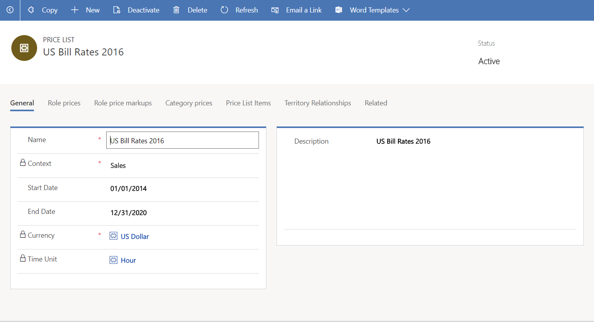
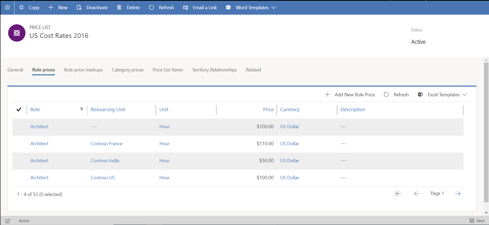
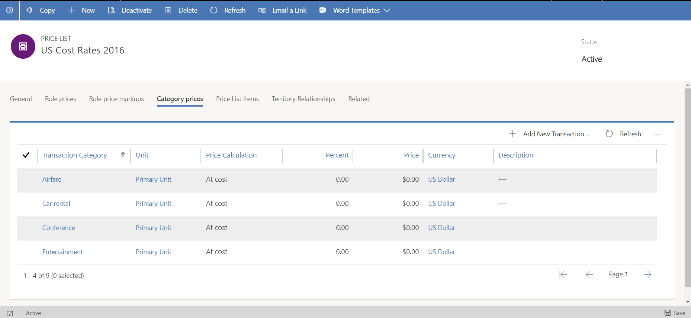
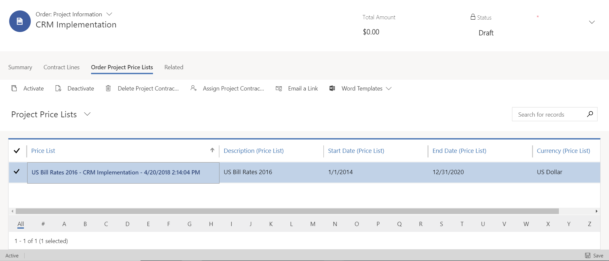

# Project pricing 

[!include [banner](../includes/psa-now-project-operations.md)]

[!INCLUDE[cc-applies-to-psa-app-3.x](../includes/cc-applies-to-psa-app-3x.md)]

Dynamics 365 Project Service Automation extends the Price list entity in Dynamics 365 Sales. 

## Key entities

A price list includes information that is provided by four different entities:

- **Price List** - This entity stores information about context, currency, date effectivity, and time unit for pricing time. Context shows whether the price list is expresses cost rates or sales rates. 
- **Currency** - This entity stores the currency of prices on the price list. 
- **Date** - This entity is used when the system tries to enter a default a price on a transaction. PSA pricing selects the price list that has date effectivity that includes the date of the transaction. If PSA pricing finds more than one price list that is effective for the transaction date is attached to the related quote, contract, or organizational unit, then no price is defaulted. 
- **Time** - This entity stores the unit of time that prices are expressed for, such as daily or hourly rates. 

The Price list entity has three related tables that store prices:

  - **Role Price** - This table stores a rate for a combination of role and organizational unit values and is used to set up role-based prices for human resources.
  - **Transaction Category Price** - This table stores prices by transaction category and is used to set up expense category prices.
  - **Price List Items** - This table stores prices for catalog products.

> 
 
The price list is a rate card. A rate card is a combination of the Price List entity and related rows in the Role Price, Transaction Category Price, and Price List Items tables.

## Resource roles

The term *resource role* refers to a set of skills, competencies, and certifications that a person must have to perform a specific set of tasks on a project.

Human resources time is usually quoted based on the role that a resource fills on a specific project. For human resource time, PSA supports costing and billing that are based on resource role. Time can be priced in any unit in the **Time** unit group.

The **Time** unit group is crated when PSA is installed. It has a default unit of **Hour**. You can't delete, rename, or edit the attributes fo teh **Time** unit group or the **Hour** unit. However, you can add other units to the **Time** unit group. If you try to delete either the **Time** unit group or the **Hour** unit, you might cause failures in the PSA business logic.

> 
 
## Transaction categories and expense categories

Travel and other expenses that project consultants incur are usually billed to the customer. PSA supports pricing of expense categories by using price lists. Airfare, hotel, and car rental are examples fo expense categories. Each price list line for expenses specifies pricing for a specific expense category. For pricing of expense categories, PSA supports the following three pricing methods:

- **At cost** - The expense cost is billed to the customer, and no markup is applied.
- **Markup percentage** - The percentage over the actual cost is billed to the customer. 
- **Price per unit** - A billing price is set for each unit of the expense category. The amount that is billed ot the customer is calculated based on the number of expense units that the consultant reports. Mileage uses the price-per-unit pricing method. For example, the mileage expense category can be configured for 30 US dollars (USD) per day or 2 USD per mile. When a consultant reports mileage on a project, the amount to bill is calculated based on the number of miles that the consultant reported.

> 
 
## Project sales pricing and overrides

For project quotes and contracts, a project price list has a different price override pattern than a product price list. On a product catalog–based quote line, you can override the price to roles and categories directly on the quote line, because each quote line points to exactly one catalog item. However, on a project-based quote line, you can't override the price to roles and categories directly on the quote line. To support the two distinct override patterns, PSA has introduced a new price list association, the project price list.

> [!NOTE]
> We recommend that you have a separate price list for your project resources and your catalog items, because of the behavior differences between the two when you override pricing.

Each of the following entities can have one or more associated sales price lists for project pricing:

- Customer (account) 
- Opportunity 
- Quote 
- Project Contract

The association of these entities with a price list is indicated by the project price lists. You can associate one or more price lists with the Customer, Opportunity, Quote, and Project Contract sales entities.

A default project price list isn't automatically entered on a customer record. However, you can manually attach a project price list to the customer record. Nevertheless, you should manually attach a project price list only when you have a custom pricing agreement with the customer. 

When a project price list is attached to a sales entity, PSA validates the following information:

- The price list las a context of **Sales**. 
- The price list currency matches the customer currency. 

On a project contract, PSA uses the following order of precedence to automatically set related project price lists:

1. Quote
2. Opportunity
3. Customer 
4. Global settings for PSA

When a project price list is entered by default, PSA validates that the currency matches the customer’s currency, and that the default price lists that have been entered have a context of **Sales**.

You can associate multiple project price lists with the Customer, Opportunity, Quote, and Project Contract entities. This capability supports date-specific default prices for a long-running project contract, where you might require more than one price list to account for price updates that occur because of inflation. However, if the price lists that you associate with the Customer, Opportunity, Quote, or Project Contract entity have overlapping date effectivity, the default prices might be incorrect. Therefore, you should make sure that project price lists that have overlapping date effectivity aren't associated with those entities.

### Deal-specific price overrides

In PSA, you can create deal-specific overrides for selected prices on project price lists that are entered by default on a quote or project contract.

By default, a project contract always gets a copy of the master sales price list instead of a direct link to it. This behavior helps guarantee that price agreements that are made iwth a customer for a statement of work (SOW) don't change if the master price list is changed.

However, on a quote, you can use a master price list. Alternatively, you can copy a master price list and edit it to create a custom price list that applies only to that quote. To create a new price list that is specific to a quote, on the **Quote** page, select **Create custom pricing**. You can access the deal-specific project price list only from the quote. 

When you create a custom project price list, only the project components of the price list are copied. In other words, a new price list created as a copy of the existing project price list that is attached on the quote, and this new price list has only related role prices and transaction category prices.

> 
  
## Tracking costs

PSA tracks costs for the use of human resource time on projects. It also tracks costs for other expenses that are incurrred during hte project, such as travel expenses.

Like bill rates, cost rates for human resources are also set up using price lists. Here are the main differences in the behavior of the cost price list and sales price list:

- The cost rate of a resource can’t be overridden on a specific project, contract, or quote. However, bill rates can be overridden on a per-deal basis if changes are made that are specific to the nature of the deal. 

- The following order is used to resolve a cost price list:

    1. The cost price list that is attached to the organizational unit.
    2. The cost price list that is attached to the project service parameters. Because cost price lists in many different currencies can be attached to project service parameters, PSA does a currency match between the currency of the contracting organizational unit of the project, contract, or quote, and the currency of the cost price list.
    3. For expenses, the at-cost and markup-over-cost pricing methods don’t apply to cost price lists. Even if these pricing methods are used on cost price list lines to set up transaction category costs, the system ignores them, and no default cost price is entered.

[!INCLUDE[footer-include](../includes/footer-banner.md)]