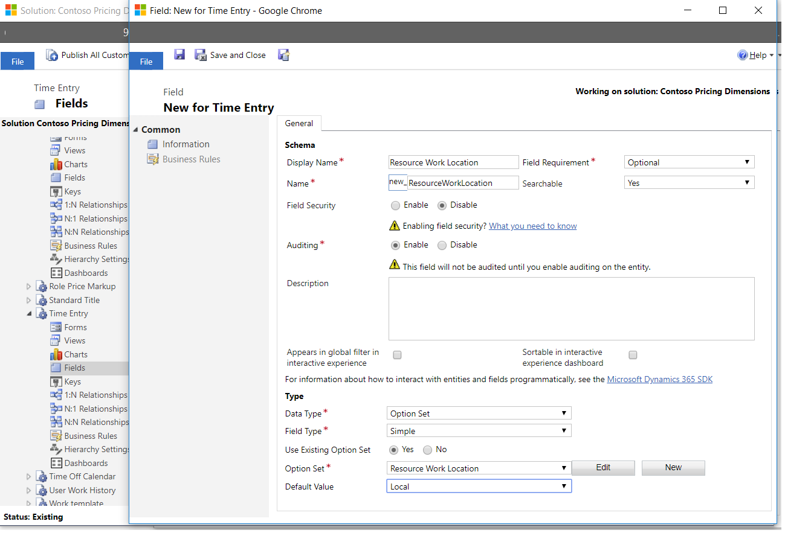
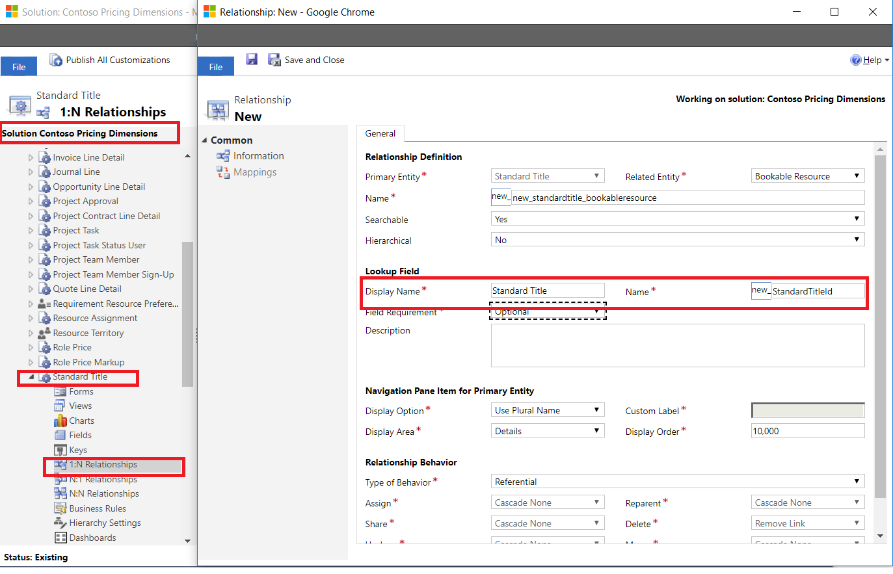
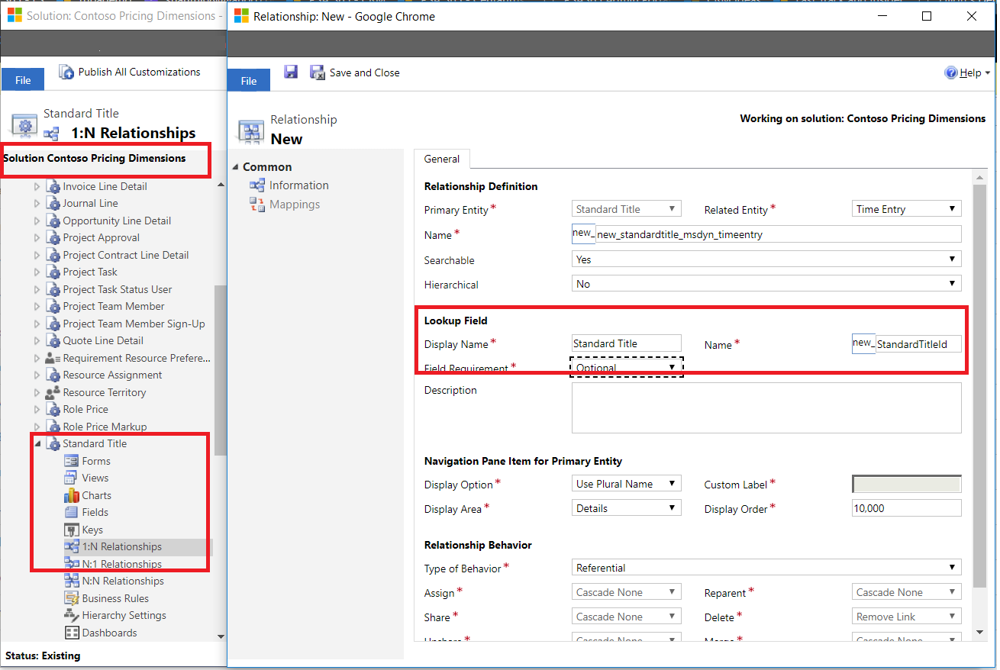
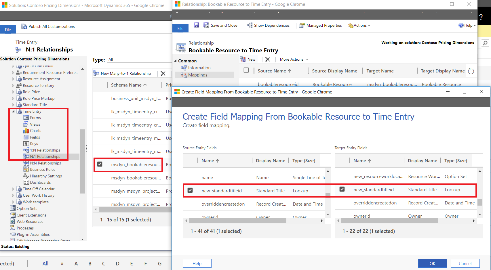

# Add custom fields to price setup and transactional entities 

[!include [banner](../includes/psa-now-project-operations.md)]

This topic assumes that you have completed the procedures in the topic, [Create custom fields and entities](create-custom-fields-entities.md). If you haven't completed those procedures, go back and complete them and then return to this topic. 

In this topic, the procedures will show you how to add the required custom field references to entities and to the user interface (UI) elements such as forms and views.

## Add custom pricing dimension fields 
After custom fields and entities have been created, the next step is to make price setup and transactional entities aware of any custom entities or option sets by creating reference fields. Depending on whether your pricing dimensions list includes option set dimensions or entity dimensions or both, follow only the steps in **Option set-based custom pricing dimensions** or **Entity-based custom pricing dimensions**, or both, respectively.

### Option set-based custom pricing dimensions
When a custom pricing dimension is option set-based, add it as a field to key Project Service entities. In the following procedure, **Resource Work Location** and **Resource Work Hours** are used as the option set-based pricing dimensions. These must first be added as fields to the pricing entities, **Role Price** and **Role Price Markup**.

1. In Project Service Automation (PSA), click **Settings** > **Solutions**, and then double-click **\<your organization name> pricing dimensions**. 
2. In Solution Explorer, on the left navigation pane, select **Entities > Role Price**.
3. Expand the entity **Role Price** and select **Fields**.
4. Click **New** to create a new field called **Resource Work Location** and select **Option set** as the field type. 
5. Select **Use an existing Option set**, select the **Resource Work Location** option set, and then click **Save**.
6. Repeat steps 1 - 5 to add this field to the **Role Price Markup** entity. 
7. Repeat steps 1 - 5 for the **Resource Work Hours** option set.

> [!IMPORTANT]
> When you add a field to more than one entity, use the same field name across all of the entities. 

> 

In the sales and estimation phases for a project, estimates of the work effort that is required to complete **Local** and **Onsite** work, in **Regular hours** and **Overtime hours**  are used to estimate the value of the Quote/Project. The fields **Resource Work Location** and **Resource Work Hours** will be added to the estimation entities, **Quote Line Detail**, **Contract Line detail**, **Project Task**, **Project Team Member**, and **Estimate Line**.

1. In PSA, click **Settings** > **Solutions**, and then double-click **\<your organization name> pricing dimensions**. 
2. In Solution Explorer, on the left navigation pane, select **Entities > Quote Line Detail**.
3. Expand the **Quote Line Detail** entity, and select **Fields**.
4. Click **New** to create a new field called **Resource Work Location** and select the field type, **Option set**. 
5. Select **Use an existing Option set** and **Resource Work Location**, and then click **Save**.
6. Repeat steps 1 - 5 to add this field to the **Project Contract line detail**,**Project Task**, **Project Team Member**, and **Estimate Line** entities.
7. Repeat steps 1 - 6 for the **Resource Work Hours** option set. 

> 

For delivery and invoicing, completed work needs to be accurately priced to select whether it was performed **Local** or **Onsite**, and whether it was completed during **Regular hours** or **Overtime** on the Project Actuals. The **Resource Work Location** and **Resource Work hours** fields should be added to the **Time Entry**, **Actual**, **Invoice Line Detail**, and **Journal Line** entities.

1. In PSA, click **Settings** > **Solutions**, and then double-click **\<your organization name> pricing dimensions**.
2. In Solution Explorer, on the left navigation pane, select  **Entities > Time Entry**.
3. Expand the **Quote Line Detail** entity, and then select **Fields**.
4. Click **New** to create a new field called **Resource Work Location** and select **Option set** as the field type. 
5. Select **Use an existing Option set**, select the **Resource Work Location** option set, and then click **Save**.
6. Repeat steps 1 - 5 to add this field to the **Actual**, **Invoice Line Detail**, and **Journal Line** entities.
7. Repeat steps 1 - 6 for the **Resource Work Hours** option set. 

> 

This completes the schema changes required for option set-based custom dimensions.

## Entity-based custom pricing dimensions

When the custom pricing dimension is an entity, you will add 1:N relationships between the dimension entity and key Project Service entities. Using the Standard Title example from above, it is reasonable to expect that each employee is assigned a standard title. SAs a result, you will need a 1:N relationship from Standard Title to Bookable Resource, or a N:1 relationship if it were created from Bookable Resource to Standard Title.

1. In PSA, click **Settings** > **Solutions**, and then double-click **\<your organization name> pricing dimensions**. 
2. In Solution Explorer, on the left navigation pane, select **Entities > Standard Title**.
3. Expand the **Standard Title** entity and select **1:N Relationships**.
4. Click **New** to create a new 1:N relationship called **Standard Title to Bookable Resource**. Enter the required information, and then click **Save**.

> 

The Standard Title will also need to be added to Project Service Pricing entities, **Role Price** and **Role Price Markup**. This is also completed using 1:N relationships between the **Standard Title** and **Role Price** entities and **Standard Title** and **Role Price Markup** entities.

1. In Solution Explorer, on the left navigation pane, select **Entities > Standard Title**.
2. Expand the **Standard Title** entity and select **1:N Relationships**.
3. Click **New** to create a new 1:N relationship called **Standard Title to Role Price**. Enter the required information, and then click **Save**.
4. Repeat steps 1 - 4 to create 1:N relationships between the **Standard Title** and **Role Price Markup** entities,

In the sales and estimation phases for the project, to price the Quote/Project, estimates of the work effort are required for each standard title. This means that 1:N relationships from Standard Title to each of these estimation entities in Project Service are needed: 

- **Quote line Detail**
- **Project Contract Line Detail**
- **Project Task**
- **Project Team Member**
- **Estimate Line**

5. Repeat steps 1 - 5 to create 1:N relationships from **Standard Title** to **Quote line Detail**, **Project Contract Line Detail**, **Project Task**, **Project Team Member**, and **Estimate Line**.

> 

In the Delivery and Invoicing phases, the work completed by each standard title must be accurately priced on the Project Actuals. This means that there needs to be 1:N relationships from **Standard Title** to **Time Entry**, **Actual**, **Invoice Line Detail**, and **Journal Line entities**.

6. Repeat steps 1 - 6 to create 1:N relationships from **Standard Title** to **Time Entry**, **Actual**, **Invoice Line Detail**, and **Journal Line entities**.

> 

### Set up Dimension value defaulting using the mappings features of the platform
For Time Entry, it would be helpful to have the system default the standard title on the Time Entry from the Bookable Resource that is recording the time entry. Use the following steps to add field mappings on the 1:N relationship from **Bookable Resource** to **Time Entry**.

1. In Solution Explorer, on the left navigation pane, select **Entities > Standard Title**.
2. Expand the **Standard Title** entity and select **1:N Relationships**.
3. Double-click **Bookable Resource to Time Entry**. On the **Relationship** page, click **Use Field mappings**. 
4. Click **New** to create a new field mapping between the **Standard Title** field on the **Bookable Resource** entity to the **Standard Title** reference field on **Time Entry** entity. 

> 

This completes the schema changes required for entity-based custom dimensions.

##  Add custom fields to forms, views, and business rules

After you have made all of the required schema changes, the next step is to make the fields visible in the UI by adding the fields to the forms and views.

1. Open the form or the view. On the right navigation pane, select the field and drag it on to the form canvas. 
2. If you are editing a view, use the right navigation pane, click **Add fields**, and in the **Field listing** dialog box, select the fields that you need and click **Ok**.

The following table provides a comprehensive list of out-of-the-box forms and views, by entity, that will need to be updated with the new fields. If you have any additional views or forms in your customizations on these entities, add the new fields to those as well.

| Project Service Entity        | Forms that need the new field   |Views that need the new field      |
| ------------------------------|---------------------------------|----------------------------------|
|  Role Price|• Information |• Active Resource Category Prices  • Resource Category Price Associated View|
|  Role Price Markup|• Information|• Active Role Price Markup • Role Price Markup Associated View|
|  Quote line detail|• Project Information • Project Quick Create|• Active Quote Line Detail • Combined Quote Line Details • Quote Line Detail associated view|
|  Project Contract line detail|• Project Information • Project Quick Create|• Combined Contract Line Details • Active Contract Line Details • Contract Line Details Associated View|
|  Project Task|• Information • New Form||
|  Project Team Member|• Information • New Form|• Active Project Team Members • Project Team Members • Project Team members associated View|
|  Time Entry|• Information • Create Time Entry|• My Time Entries By Date • My time Entries for this week • Time entries for approval|
|  Journal Line|• Information • Quick create|• Active journal lines • Journal Line associated view|
|  Invoice Line Detail|• Information • Quick create|• Active Invoice Line Details • Chargeable Invoice Transactions • Complimentary Invoice Transactions • Invoice Line Detail associated view • Non-Chargeable Invoice Transactions|
|  Actual|• Information • Active Actuals|• Actual Associated view|

Custom fields may also need to be added on business rules depending on what you have defined. One out-of-the-box example is for the business rule **Editability of Time Entry based on status**. This rule defines which fields need to be locked when the Time Entry is in a non-editable status such as **Approved**. Add fields to this business rule so that the fields are locked for editing when the Time Entry is in a status other than **Draft** or **Returned**.
