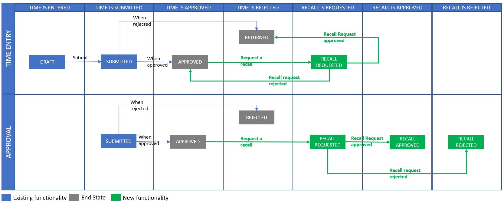
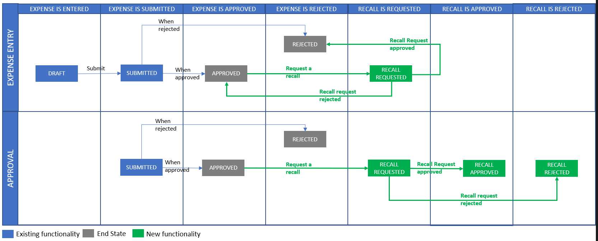

# Recall approved time or expense entries

[!include [banner](../includes/psa-now-project-operations.md)]

[!INCLUDE[cc-applies-to-psa-app-3.x](../includes/cc-applies-to-psa-app-3x.md)]

A project team member or an other person who submits a time or expense entry can recall that time or expense entry after it has been approved. The process for recalling an approved time or expense entry has two steps:

1. A submitter requests a recall.
2. An approver approves the recall.

## Request a recall

Follow these steps to request a recall of an approved time or expense entry.

1. For time entries, go to **Projects** \> **My Work** \> **Time Entry**.

    –or–

    For expense entries, go to **Projects** \> **My Work** \> **Expenses**.

2. For time entries, select all the time entries for a specific combination of a project and a task. Alternatively, in the grid, select the individual cells for time on a specific date for a specific project.

    –or–

    For expense entries, select the row for the expense entry to recall.

3. Select **Recall**. A confirmation dialog box appears. If the selected time and expense entries were already approved, you're prompted to enter a reason for the recall.
4. Enter a reason for the recall, and then select **OK** to confirm the operation. The system sends the person who approved the entries a request to approve the recall.

> [!NOTE]
> Although approved time and expense entries can be recalled, if an approved time or expense has already been invoiced to the customer, a recall request can't be created. A user who tries to create a recall request will receive a message that states that the time or expense can't be recalled because it was already invoiced.

## Approve or reject a recall request

Follow these steps to approve or reject a recall request.

1. Go to **Projects** \> **My Work** \> **Approvals**.
2. On the **Approvals** list page, change the view to **Recall requests for approval**. A list of submitted recall requests is shown.
3. Select one or more entries, and then select either **Approve** or **Reject**.
4. If you selected **Approve**, you receive a warning message that explains the impact of the approval. Select **OK** to confirm the operation. The recall request is approved.

    –or–

    If you selected **Reject**, the recall request is rejected.

> [!NOTE]
> As when a recall is requested, when a recall is approved, the system checks for any invoicing activity on the time or expense entries. If an entry was already invoiced, or if it's on a draft invoice, the approver will receive an error message that states that the time or expense can't be approved for recall, because it was already invoiced.

## Impact of a recall request

When an approval is recalled, there is both operational impact and financial impact.

### Operational impact

If a recall request is approved, the approval record is marked as **Rejected**. The status of the entry is changed to either **Returned** or **Rejected**, depending on whether it's a time entry or an expense entry.

The project team member can view entries, edit and then resubmit entries, or delete entries entirely.

If a recall request is rejected, the status of the entry remains **Approved**, and the entry can't be edited by the project team member or the approver for the project.

### Financial impact

If a recall request is approved, the corresponding actuals for cost and sales are updated in the following manner:

- The **Adjustment Status** field is updated to **Adjusted**.
- The **Billing Status** field is updated to **Canceled**.

Next, reversal entries are created in the Actuals table. To create reversal entries, the system copies over the field values from the original actuals. The only values that aren't copied over are the quantity values. These values are reversed instead. Reversed actuals are created for both **Cost** and **Unbilled Sales** actuals. The **Adjustment Status** field on the reversed actuals is set to **Unadjustable**, and the **Billing status** field is set to **Canceled**. Because of these changes, the recorded spending and the revenue backlog on the project will no longer account for the amounts that these actuals represent.

If a recall request is rejected, there is no financial impact on the project.

## Changes to time entry records

The following illustration shows the changes that occur for approved time entries when they are recalled.

## Changes to expense entry records

The following illustration shows the changes that occur for approved expense entries when they are recalled.

[!INCLUDE[footer-include](../includes/footer-banner.md)]