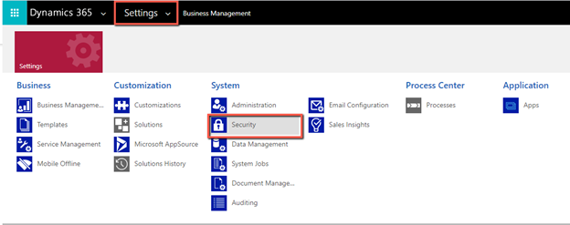
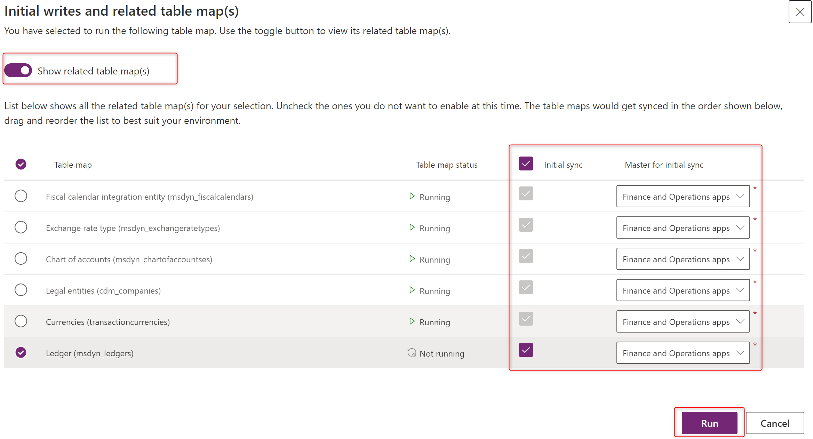

Updating your Finance and Operations environment.
=================================================

These are the high-level steps we will follow to update Project Operations to
Update 5(UR5)

### Import the package into your preview project

1. Sign in to <https://lcs.dynamics.com/> with the Project Owner or Environment
manager security access.

2. From the list of projects in Lifecycle Services select your LCS project

3. Open the Environment you would like to update:

4. Ensure that the environment is Started:

If it is **not started**, *please start the environment*.

5. Scroll to the Available updates section and select View update for 10.0.15
update.

6. Click **Save package.**

7. In the next screen (1) click Save package, (2) give package a name, (3)
confirm saving the package

8. Once package saves Done button becomes available. Click Done. LCS next will
verify the package, this process can take few minutes to an hour.

9. Navigate to environment details and select **Maintain** and **Apply Updates**

10. Select the package Saved in the previous step and **Apply.**

11. Confirm the installation of the Update, select **Yes**:

12. Second confirmation that the Application will be updated, select **Yes**:

13. *Servicing* will begin and apply the update:

14.Around 2 hrs later you should have the update applied, note the Application
release is

Microsoft Dynamics 365 for Finance and Operations (10.0.15) and the status is
deployed.

Updating your Customer Engagement Environment
=============================================

1. Login to the Power Platform admin center via
<https://admin.powerplatform.com/>

2. Locate the environment which you used to install Project Operations from the
list and open the environment details by clicking on the name of the
environment.

3. Open the **Resource** from the ribbon at the top and select **Dynamics 365
apps**.

4. Select the Update Available link located next to Microsoft Dynamics 365
Project Operations

5. Agree to the terms of service and press update 4.5.0.134

The system will proceed to install the latest version of the solution:

6. Wait for the solution to complete installing, once complete the update is
complete.

Once complete your new version with Update 5 should have the version
4.5.0.134**.**

Configuring the new features
============================

Enabling Dual Write Mappings
----------------------------

Once you have completed the update on both the Finance and Operations side and
the Customer Engagement side you are ready to enable required dual write
mappings for this release.

These are the high-level steps we will follow to enable the feature:

1.  Update security settings on Customer Engagement environment

2.  Refresh data entities

3.  Update and run the dual write mappings

Update security settings on Customer Engagement environment
-----------------------------------------------------------

The following entity security privilege updates are required as part of the
update to UR5.

Navigate to Settings \> Security

In the Settings Menu, select Security Roles

From the list of roles, select Dual Write App user and navigate to the Custom
Entities tab. Ensure the role has read and append to permissions for the
Currency Exchange Rate Entity.

Once the security has been updated, navigate to the default team and ensure that
the Dual Write App user role has been applied to the team Settings \> Security
\> Teams.

Confirm the Dual Write Write App role is associated with the default team.

Need to document adding Currency Exchange rate types entity read privilege to
Dual Write App User security role and adding this role to default team in CE

Refresh the data entities from the Update
-----------------------------------------

1. Now we will Refresh the data entities, open the Data Management area by
typing “*data management*” in the search at the top and open **Framework
parameters**

2. Update the entity list through the **Entity settings** \| **Refresh entity
list**

3. Confirm

Pause – breath, maybe make a coffee. This process will take some time to
complete (est around 20 min). You will be alerted once complete.

Updating the Dual Write mappings
--------------------------------

1.  In Data Management workspace select Dual Write tile.

2.  Click Apply Solutions button, select both solutions and click apply.

3.  Stop following maps:

    1.  Project Operations integration project expense categories

    2.  Project Operations integration project expenses export entity

    3.  Project Operations integration actuals

 

4.  Apply new version of the map to each of those three entities
 
 

5.  Restart the maps
 
 

6.  Start Ledger map with all prerequisites and initial sync. Set master for
    initial sync to Finance and Operations apps
 
 
